# 1차 학습이 넘어진 이유

2026-08-15  
런: `logs/rsl_rl/rough_spot_with_arm/2026-08-15_13-54-47/` · `model_1499.pt` (1500 iter, 약 56분)  
태스크: `Isaac-Velocity-Rough-Spot-Arm-v0` / PLAY `...-Play-v0`  
환경 수: **2048** (README·Isaac Lab 기본은 4096) · PPO

영상: [videos/rl-video-step-0.mp4](videos/rl-video-step-0.mp4)

---

## 1. 보상

한 스텝 보상 = Σ (`weight` × 항).  
양수 = 키우라는 신호, 음수 = 줄이라는 신호(벌점), **0 = 학습에 안 들어감**.

코드 이름 = TensorBoard `Episode_Reward/...` 이름. 아래 가중치는 1차에 실제로 쓰인 값.

| 이름 | 가중치 | 하는 일 |
|---|---:|---|
| `track_lin_vel_xy_exp` | +1.0 | 명령한 **앞/옆 속도**를 맞추면 큼. 걷는 보상. |
| `track_ang_vel_z_exp` | +0.5 | 명령한 **제자리 회전(yaw)** 을 맞추면 큼. |
| `feet_air_time` | +1.0 | 발이 공중에 있다가 **다시 땅에 닿을 때** 줌. 걸음이 나와야 의미 있음. |
| `flat_orientation_l2` | **0** | 몸이 기울면 벌점이어야 하는데 **꺼 둠**. |
| `lin_vel_z_l2` | −2.0 | 몸통이 위아래로 튀면 벌점. |
| `ang_vel_xy_l2` | −0.05 | 몸통이 앞뒤/좌우로 구르면 벌점. |
| `dof_torques_l2` | −0.0002 | 다리 모터가 세게 쓰면 벌점. |
| `dof_acc_l2` | −2.5e−7 | 관절이 급가속하면 벌점. |
| `action_rate_l2` | −0.01 | 이번 행동과 직전이 많이 다르면 벌점. |
| `undesired_contacts` | −1.0 | 허벅지·엉덩이·팔이 땅에 세게 닿으면 벌점. |
| `dof_pos_limits` | −1.0 | 관절이 한계를 넘으면 벌점. (코드 원래 −10, 학습 불안정해서 −1로 줄임) |
| `arm_joint_deviation` | −1.0 | 팔이 접힌 자세에서 벗어나면 벌점. |

`track_lin_vel_xy_exp`: 환경이 “앞으로 1.2 m/s” 같은 명령을 줌. 몸통 실제 앞/옆 속도와의 차이를 지수로 점수화함. 잘 따라가면 1 근처, 명령과 상관없으면 0 근처. 1차 끝 값 **0.0022** → 서지도 못하고 넘어져서 속도를 맞출 틈이 없음.

`track_ang_vel_z_exp`: 같은 방식, 수직축 회전. 끝 값 **0.0057**.

보상이 아니라 **에피소드를 중간에 끊는 것**:

| 이름 | 하는 일 |
|---|---|
| `time_out` | 20초 버티면 정상 종료. |
| `bad_orientation` | 기울기 약 57도(`limit_angle=1.0` rad) 넘으면 즉시 리셋. |
| `base_contact` | 몸통·팔이 땅에 세게 닿으면 리셋. |
| `root_too_high` / `root_too_fast` | 높이/속도 비정상. 1차에선 거의 안 나옴. |

`flat_orientation_l2`는 가중치 0인데, 기울면 `bad_orientation`으로 에피소드가 잘림.  
세우라는 점수는 안 주고, 기울면 시도만 버림.

---

## 2. 화면 · 그래프 (먼저 봄)

PLAY `model_1499.pt`, 4대, 카메라 2.4초. PLAY가 `max_init_terrain_level = None`이라 **계단 꼭대기**에 올라감. 평지에서도 0.28초면 계단에선 더 빨리 넘어짐.

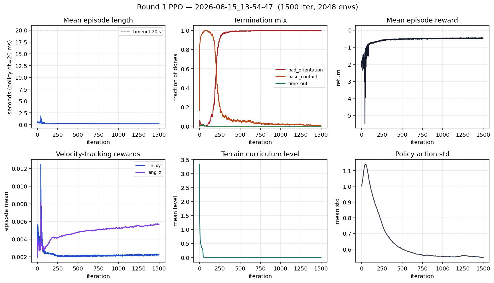

\* 가로축 전부 iteration. 길이·종료·보상·지형 레벨·행동 std.

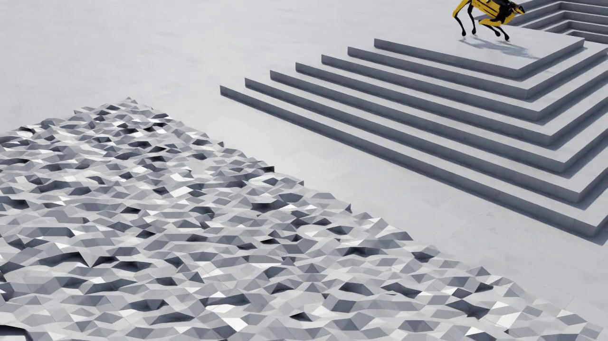

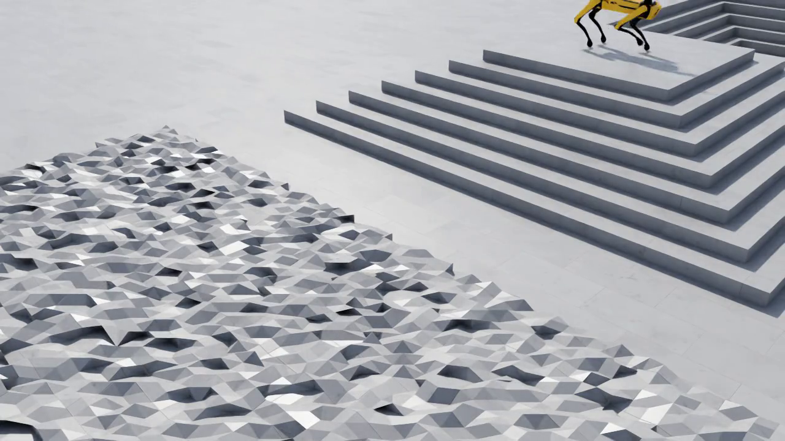

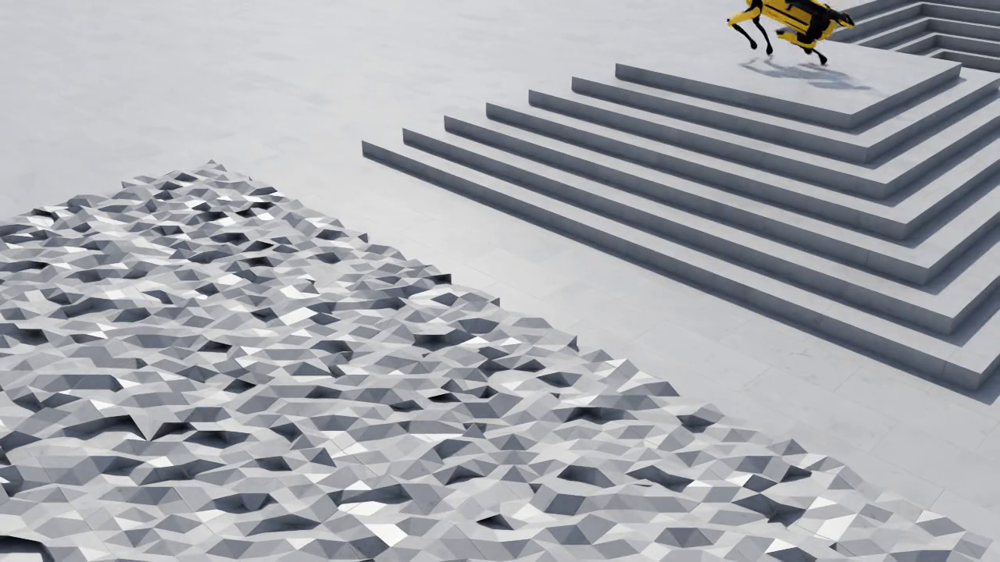

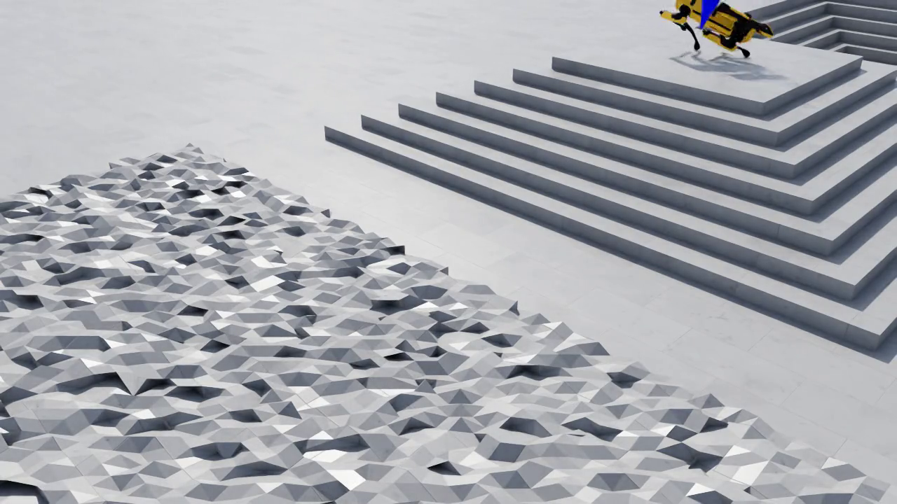

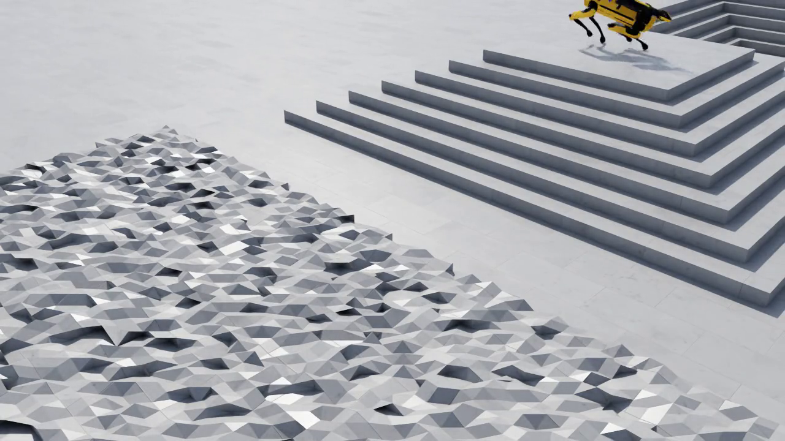

오른쪽 다리가 발판에서 떨어져 있음. 앞다리가 들리고 뒷다리만 계단 끝에 걸침. 그다음 옆으로 구름.  
“오른쪽은 땅에 안 디딤 / 바로 쓰러짐”이 이 프레임들임.

---

## 3. 한 줄

`feet_air_time` 가중치만 만져서 다시 돌릴 때가 아님.

- 화면: 오른쪽 다리 안 닿음, 약 1초 만에 옆로 넘어짐.
- 평균 에피소드 길이 마지막 **14.2 스텝 = 0.28초**. 제한은 20초.
- **99.9%가 `bad_orientation`으로 끝남.** 20초 버틴 비율 0%.
- `track_lin_vel_xy_exp` 1500 iter 내내 **약 0.002**. 걸었다는 신호 없음.
- 지형 레벨 3.3 → **0**에서 멈춤.

걷는 걸 배운 게 아니라, **빨리 죽는 쪽을 배운 것임.**

inspect에서 네 발이 땅에 붙어 보인 이유: 그 스크립트가 **매 물리 스텝마다 관절을 강제로 다시 넣음**. 학습/PLAY에는 그거 없음.

시간 단위: 정책 1스텝 = 0.02초 (`dt=0.005` × `decimation=4`).  
`mean_episode_length=14.2`는 14초가 아니라 **0.28초**임.

---

## 4. 빨리 죽는 걸 학습함 · clipping도 있었음

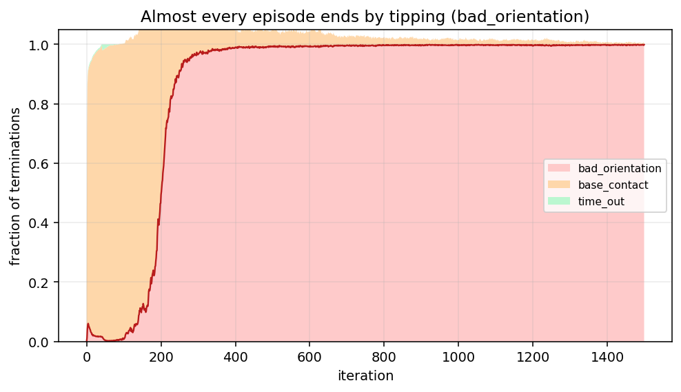

\* `Episode_Termination/bad_orientation`, `base_contact`, `time_out`

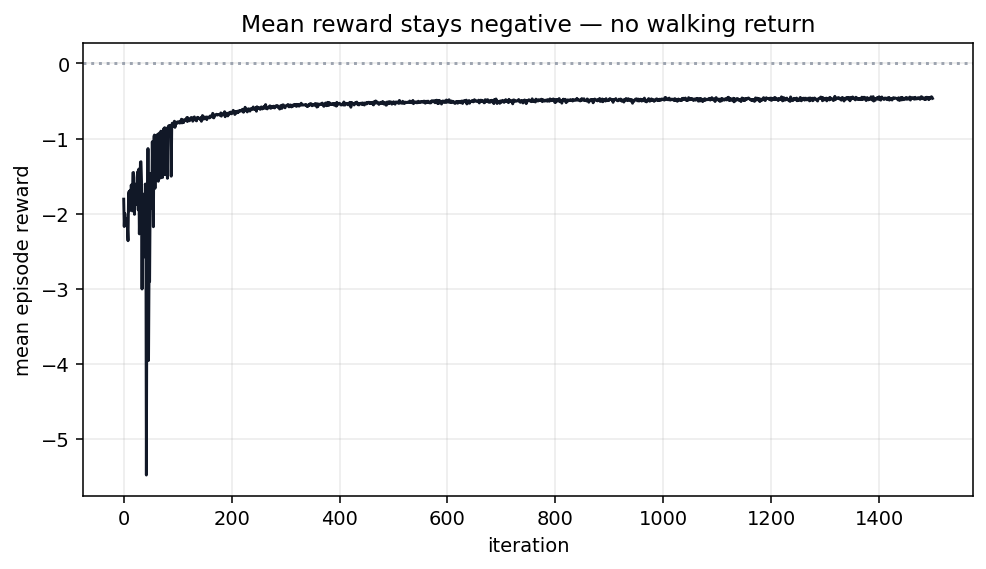

\* `Train/mean_reward`

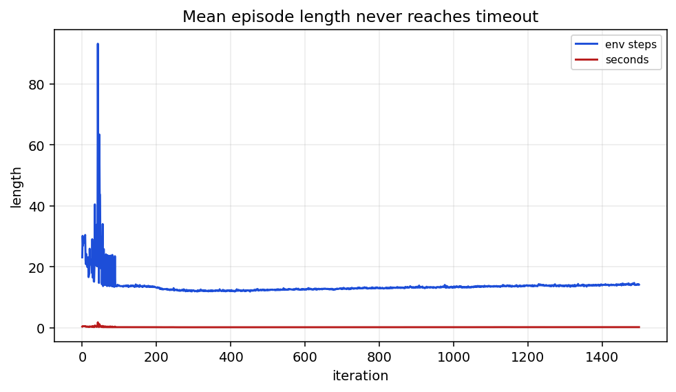

\* `Train/mean_episode_length` (파랑=스텝, 빨강=초)

초반(iter 50~150): `base_contact`가 거의 100%. 주저앉아 몸통이 바닥에 찍힘.  
그다음 `bad_orientation`이 1에 붙음. 몸통이 찍히기 **전에** 기울기 한도로 에피소드를 자름.

왜 이게 “학습”이냐:

- 몸통이 찍히면 `undesired_contacts` 벌점 + `base_contact` 리셋이 같이 옴.
- 기울기 한도에 먼저 걸리면 에피소드가 더 짧아져서, 벌점을 **덜 쌓음**.
- 평균 보상이 −1.8 → −0.47로 덜 음수가 된 이유임. 걸어서가 아님.
- 길이도 23스텝 → 14스텝으로 **더 짧아짐**. 오래 버티는 쪽이 아니라 빨리 끝나는 쪽으로 감.

PPO/관측 쪽에 clipping도 있었음. 그래도 위 방향으로 감.

| 뭐를 자름 | 설정 | 역할 |
|---|---|---|
| PPO 비율 | `clip_param=0.2` | 한 번에 정책을 너무 크게 안 바꿈 |
| value clipping | `use_clipped_value_loss=True` | 가치 함수 업데이트를 자름 |
| 그래디언트 | `max_grad_norm=1.0` | 기울기 폭발 방지 |
| 관측 | 각 `ObsTerm`의 `clip=(...)` | NaN/이상치가 네트워크로 안 들어가게 자름 |

이 clipping은 “넘이지 마라”가 아님. 학습이 터지지 말라고 숫자를 자르는 장치임.  
에피소드를 자르는 건 `bad_orientation` / `base_contact` 쪽임.  
정책이 고른 건 **벌점을 덜 받으려고 빨리 리셋되게 기울어지는 것**.

`Policy/mean_std` 1.00 → 0.55. 노이즈를 줄이면서 그 짧은 발버둥을 정답처럼 굳힘.  
그래서 `model_1499.pt`에서 resume 하면 안 됨. 2차는 처음부터.

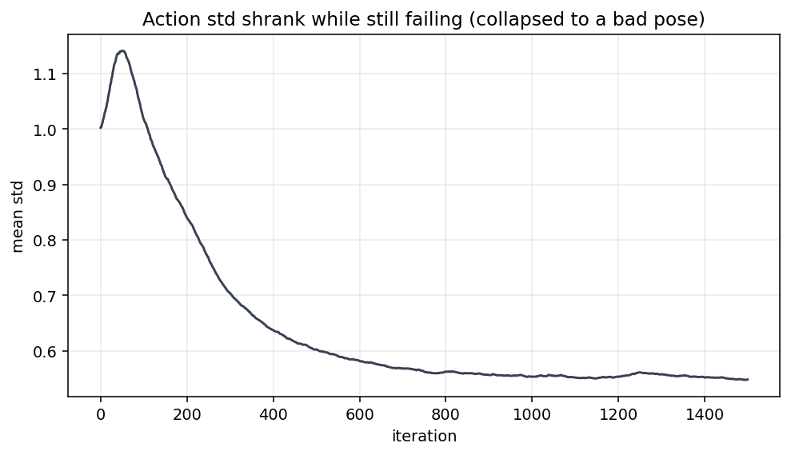

\* `Policy/mean_std`

---

## 5. 보상 항이 실제로 어떻게 나왔는지

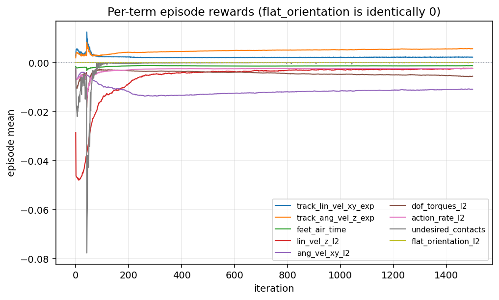

\* `Episode_Reward/<이름>`

끝 시점:

| 항 | 가중치 | 끝 값 | 읽기 |
|---|---:|---:|---|
| `track_lin_vel_xy_exp` | +1.0 | **0.0022** | 앞/옆 속도 명령을 거의 못 맞춤 |
| `track_ang_vel_z_exp` | +0.5 | 0.0057 | 회전도 거의 못 맞춤 |
| `feet_air_time` | +1.0 | **−0.0013** | 들어서 착지하는 걸음 없음 |
| `flat_orientation_l2` | **0** | **0** | 꺼 둔 항 |
| `lin_vel_z_l2` | −2.0 | −0.0023 | 에피소드가 짧아 절대값도 작음 |
| `ang_vel_xy_l2` | −0.05 | −0.011 | 구르면서 각속도 벌점 |
| `dof_torques_l2` | −0.0002 | −0.0056 | |
| `action_rate_l2` | −0.01 | −0.0025 | |
| `undesired_contacts` | −1.0 | ≈ 0 | 후반엔 몸통 닿기 전에 죽음 |
| `arm_joint_deviation` | −1.0 | −0.0008 | 팔 PD는 stow를 잘 붙잡음 |
| `dof_pos_limits` | −1.0 | −0.0053 | 관절 한계가 주된 문제 아님 |

`feet_air_time` 가중치를 올린다고 안 걸음. 0.28초면 네 발이 걸음 한 바퀴를 돌 시간이 없음.  
팔만 거의 0. 팔 Kp=120은 제 일 함. 문제는 다리.

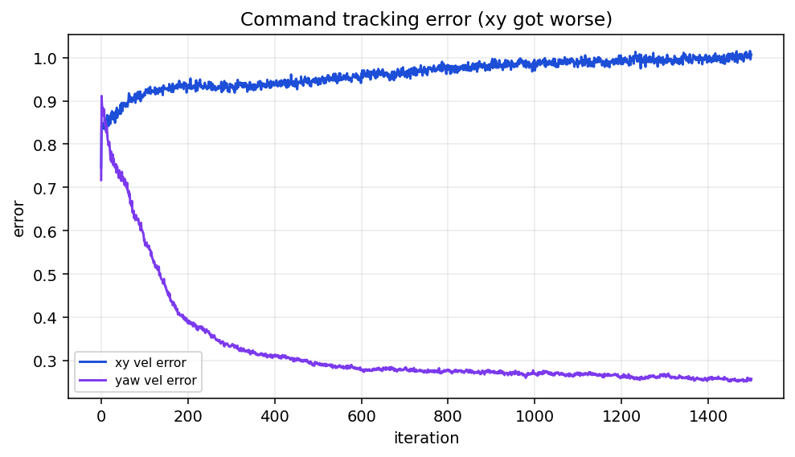

\* `Metrics/base_velocity/error_vel_xy`, `error_vel_yaw`

앞/옆 오차 0.75 → **1.01** (커짐). yaw 오차 0.72 → 0.26.  
yaw가 줄었다고 회전을 잘한 게 아님. 스폰 자리에서 쓰러져서 큰 회전을 따라갈 틈이 없음.

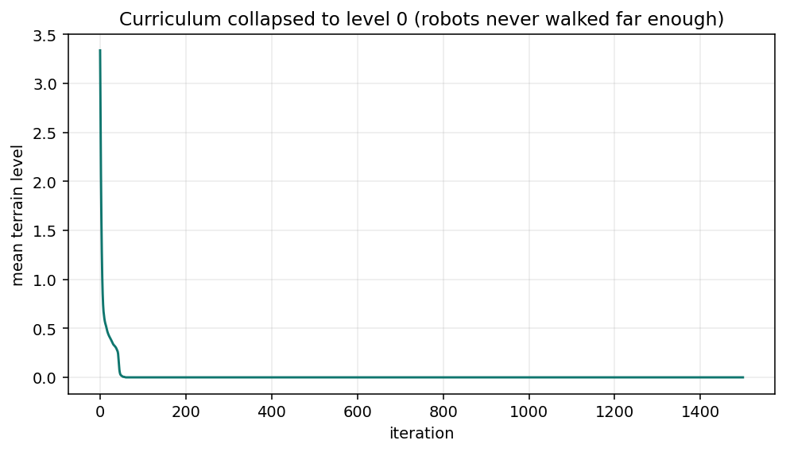

\* `Curriculum/terrain_levels`  시작 3.34 → 곧 **0**, 이후 그대로.

멀리 걸으면 어려운 칸, 넘어지면 쉬운 칸. 0.28초에 넘어지면 매번 “못 감” → 레벨 0에서 멈춤.  
`max_init_terrain_level = 5`는 서지도 못하는 로봇을 처음부터 중간 난이도 rough에 넣은 것임.

---

## 6. 환경 수 4096 vs 2048

README·Isaac Lab 기본은 **4096**.

```bash
python scripts/train.py --task Isaac-Velocity-Rough-Spot-Arm-v0 --num_envs 4096 --headless
```

- Isaac Lab: <https://github.com/isaac-sim/IsaacLab/blob/main/source/isaaclab_tasks/isaaclab_tasks/manager_based/locomotion/velocity/velocity_env_cfg.py> (`num_envs=4096`)
- Rudin et al. 2021, 병렬 4096대: <https://arxiv.org/abs/2109.11978>

1차 실제 명령은 `--num_envs 2048`. `params/env.yaml`에도 2048.  
RTX 5080 16GB에서 처음 여유 두고 줄인 것임. 학습 중 VRAM 약 5GB. 4096도 들어갈 여지 큼.

2048이라서 0.28초에 넘어진 건 아님. 대수를 늘려도 서지 못하면 같은 전복이 더 많이 쌓일 뿐임.  
그래도 2차는 **4096**으로 맞추는 게 README·Lab·논문과 같음.

---

## 7. 왜 섰다고 착각했는지 / 왜 바로 넘어지는지

### 지금 — inspect가 매 스텝 관절을 덮어씀

`scripts/inspect_robot.py`: 다리 PD가 약해서 발이 꺼지지 말라고, **매 스텝 root+관절을 다시 씀**.

학습/PLAY는 정책 출력 12개를 `기본각 + 0.25 × 행동`으로 PD 목표만 줌.  
행동 0이어도 버티는지는 Kp/Kd와 발 간격에 달림.  
inspect에서 서 있음 ≠ 학습에서 섬. 다른 실험임.

2차 전: inspect 덮어쓰기 끄고, 평지 1대, 기본 자세 PD만으로 5초 이상 네 발 접지 확인. 실패면 학습 안 함.

### 지금 — 다리 PD가 Isaac Lab Spot 예시의 1/3

**Boston Dynamics 펌웨어 값이 아님.**

지금 Kp=20, Kd=0.5는 `legged_gym`에서 옮김.

- `/home/june/legged_gym/legged_gym/envs/spot/spot_with_arm_config.py`

60 / 1.5 는 Isaac Lab이 **팔 없는 Spot USD**에 넣은 값. 무릎 토크 표만 “BD AI Institute 측정”이라고 주석에 있음. Kp와 `hip_x=±0.1`까지 BD 공식이라 쓰여 있진 않음.

- <https://github.com/isaac-sim/IsaacLab/blob/main/source/isaaclab_assets/isaaclab_assets/robots/spot.py>
- 평지 Spot 과제(기립 벌점 −3): <https://github.com/isaac-sim/IsaacLab/blob/main/source/isaaclab_tasks/isaaclab_tasks/manager_based/locomotion/velocity/config/spot/flat_env_cfg.py>

| 항목 | 1차 | Isaac Lab Spot 예시 |
|---|---|---|
| 다리 Kp | 20 | 60 |
| 다리 Kd | 0.5 | 1.5 |
| `hip_x` | 전부 0 | 왼쪽 +0.1, 오른쪽 −0.1 (밖으로 벌림) |
| `hip_y` | 전부 0.8 | 앞 0.9, 뒤 1.1 |
| `knee` | −1.5 | −1.5 |
| 기립 벌점 | `flat_orientation_l2` = **0** | `base_orientation` = **−3.0** |

PD 힘 ≈ `Kp × (목표각 − 현재각)`. 몸통 ~33 kg + 팔 ~6 kg. 접은 무릎으로 받치려면 스프링이 세야 함.  
Gym과 Lab은 같은 Kp가 같은 강성이 아님. 20이면 다리가 주저앉고, 한쪽 발이 먼저 뜸 → 화면에 “오른쪽이 안 닿음”.

`hip_x` 축이 네 다리 모두 앞뒤(`1 0 0`). 같은 +0.1이면 한쪽은 벌리고 한쪽은 오므림.  
Lab 예시는 왼쪽 +, 오른쪽 − 로 **둘 다 밖**. 지금은 전부 0이라 발 간격이 좁음. 위에 팔 무게 있으면 옆으로 넘어지기 쉬움.

오른쪽 hip이 URDF에서 반대로 들어갔는지는, 평지·행동 0에서 오른쪽만 접히면 그때 의심함. inspect FK에선 네 발이 땅에 닿았고 `hip_y` 축은 전부 `0 1 0`.

### 지금 — 기립 점수 0, 기울면 에피소드만 잘림

```python
self.rewards.flat_orientation_l2.weight = 0.0
```

`bad_orientation` `limit_angle=1.0`.  
울퉁불퉁 지형에선 “항상 수평”이 정답이 아니라서 자세 벌점을 약하게 두는 경우가 있음. 전제는 **평지에서 이미 서는 정책**. 지금은 그 전제가 없음.

바로 서 있어도 추가 점수 없음. 57도만 기울어도 시도 끝.  
할 수 있는 최선이 “몸통 찍히기 전에 기울기 한도로 죽기” → 4절.

### 그 다음 — 첫 학습을 거친 지형에서 시작함

학습: 10×20 rough, `max_init_terrain_level = 5`.  
PLAY: `max_init_terrain_level = None` → 위 캡처처럼 계단 꼭대기.

2차는 평지에서 서는 게 목표. PLAY도 평지, 칸당 1대.

### 그 다음 — 발 접촉 신호가 의심스러움

로그에 반복됨:

```text
Failed to find rigid body ...
Failed to find contact report API at '.../arm_link_...'
```

URDF가 `Geometry/body/...`로 중첩됨. 기본 접촉 센서가 첫 강체에서 멈춰 발·팔 리포트가 빠질 수 있음. 코드에서 리포터를 달았지만 경고는 남음.

`feet_air_time` / `undesired_contacts` / `base_contact`가 이 힘에 의존함.  
2차 전: 서 있는 상태에서 다리 네 개 `*_lower_leg` 접촉힘이 0이 아닌지 확인.

### 선 다음에

- 행동 12차원, 스케일 0.25, 관측에 팔 7관절 — 구조는 유지해도 됨.
- Lab 평지 Spot에는 대각 발 페어, 발 높이, 미끄러짐, 기립 −3이 더 있음.
- 1500 iter는 기립만 돼도 짧음. 평지에서 선 뒤 3000+ 보는 편이 나음.
- 리셋 때 다리 관절 80~120% 랜덤 (`position_range=(0.8, 1.2)`). PD 약하면 나오자마자 넘어짐.
- 2차 환경 수 4096.

---

## 8. 이렇게 읽으면 안 됨

- 오른쪽 hip 부호가 반대라서만 접힘 → 평지·행동 0에서 확인하기 전엔 단정 안 함.
- `feet_air_time` / `track_lin_vel_xy_exp` 가중치만 올리면 걸음 → 걸음 한 바퀴 돌 시간이 없음.
- 보상이 −1.8 → −0.47이라 학습됨 → **빨리 죽어서 벌점을 덜 쌓은 것임.**
- inspect에서 서 있으니 자세 끝 → 매 스텝 덮어씀.
- PLAY가 계단에서 넘어지니 rough를 더 넣음 → PLAY 스폰이 계단임.
- `model_1499.pt`에서 resume → 0.28초에 죽는 동작이 굳어 있음.
- 2048이라서 실패 → 원인 아님. 그래도 2차는 4096.

---

## 9. 2차 전에 (이 순서)

1. 평지 1대, inspect 덮어쓰기 없이, 기본 자세 PD만으로 5초+ 네 발 접지. 실패면 학습 안 함.
2. 다리 Kp/Kd 60 / 1.5, `hip_x` 왼쪽 +0.1 / 오른쪽 −0.1. 1) 다시 통과.
3. `flat_orientation_l2` 음수 (예: −1 ~ −3). Lab 평지 Spot은 `base_orientation` −3.0.
4. 학습·PLAY 평지. `track_lin_vel_xy_exp` 올라가면 그때 rough.
5. 발 네 개 접촉힘 > 0 확인.
6. `--num_envs 4096`, 처음부터, 200 iter에 길이 수 초 / `bad_orientation` 하락 / `track_lin_vel_xy_exp` 상승이 없으면 1)~5) 다시. `model_1499` resume 안 함.

2차 분석: [../round-03/01-2차-서기만함.md](../round-03/01-2차-서기만함.md). 이 폴더는 덮어쓰지 않음.

---

## 10. 다시 뽑기

숫자: [data/round1_metrics.json](data/round1_metrics.json)

```bash
source scripts/isaaclab_env.sh
python docs/training/round-02/export_tensorboard_figures.py

tensorboard --logdir logs/rsl_rl/rough_spot_with_arm/2026-08-15_13-54-47
```
