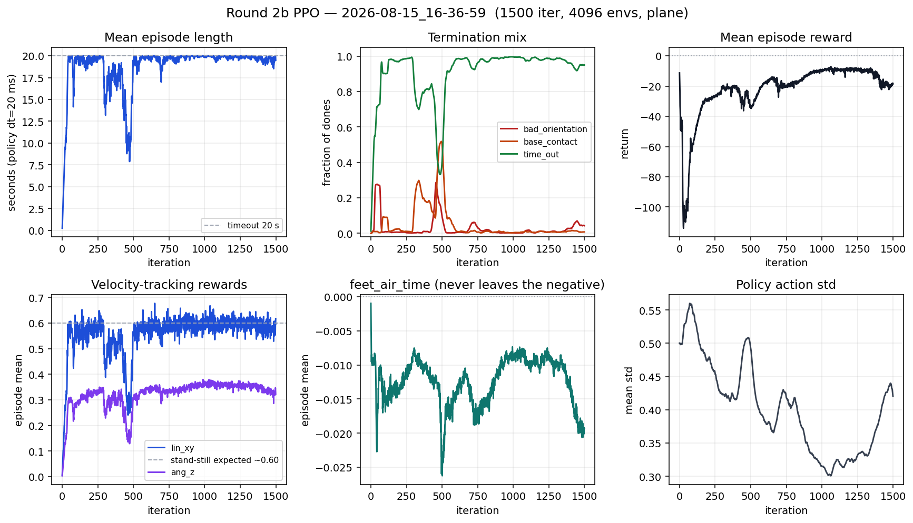
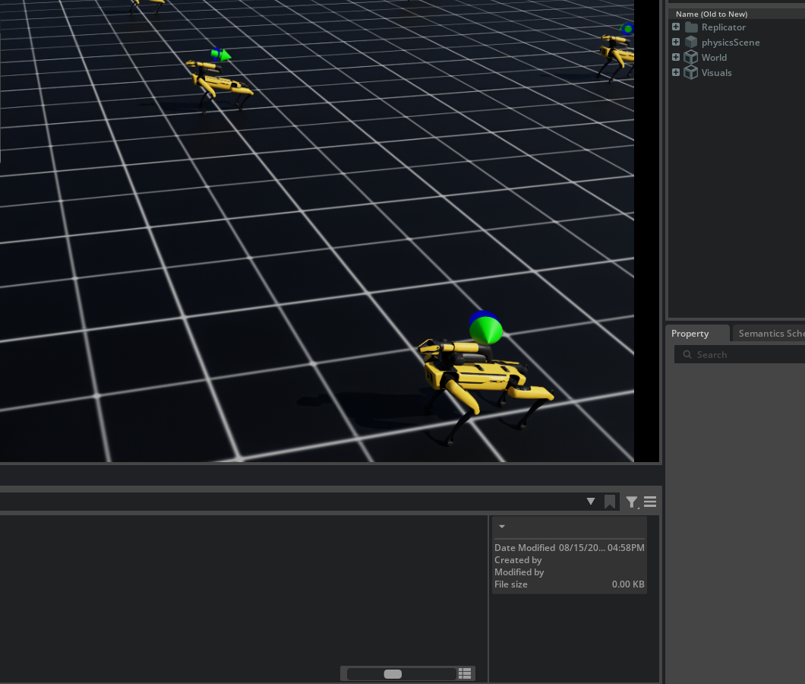
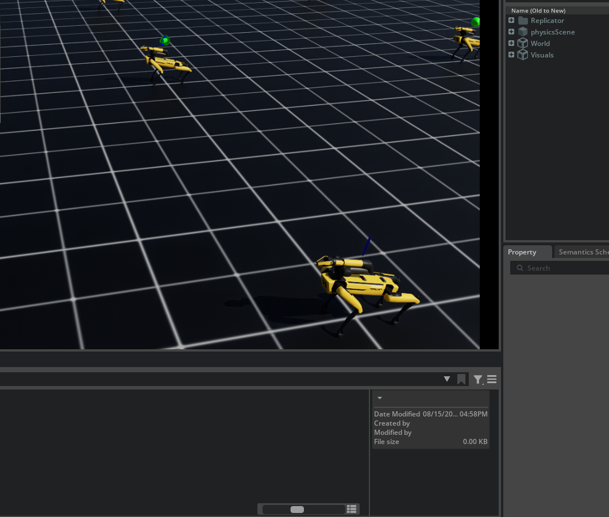
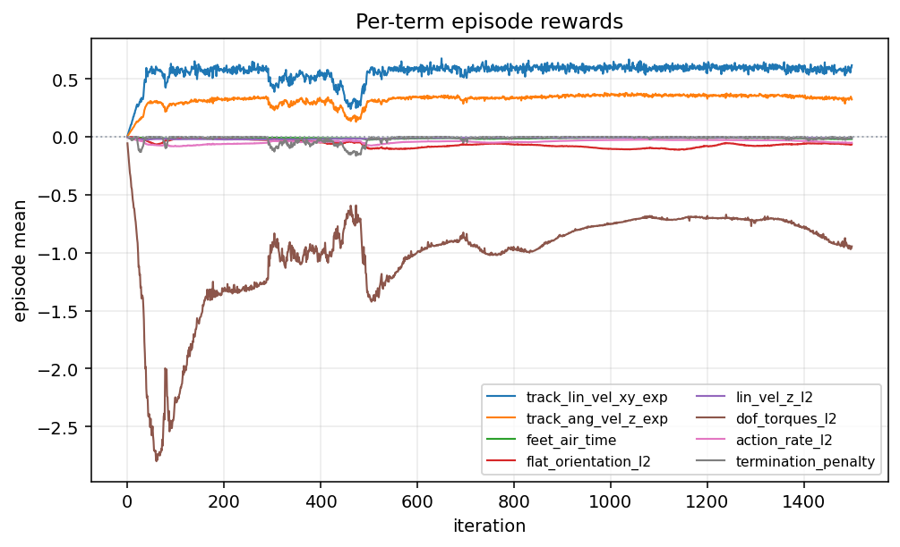
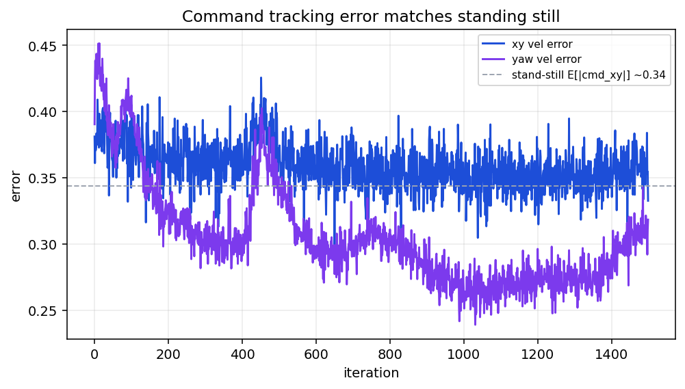
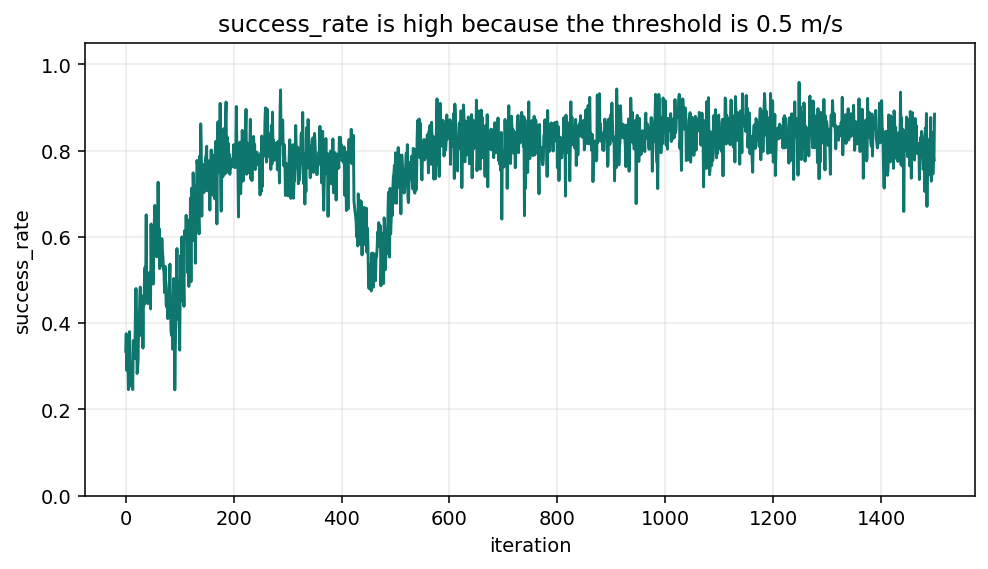
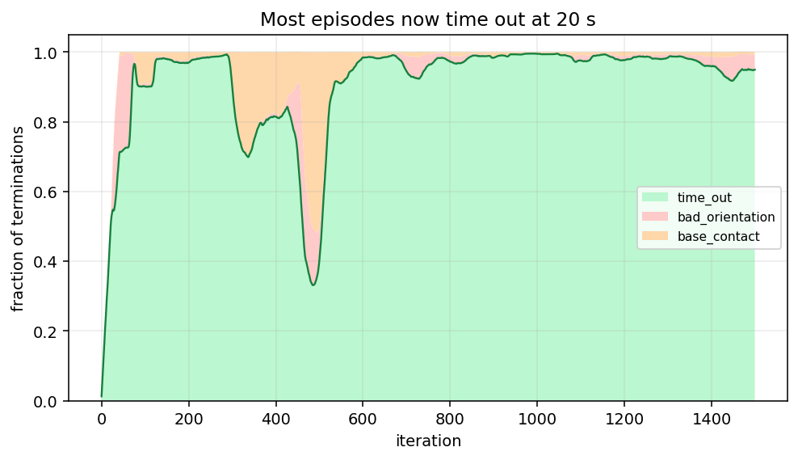
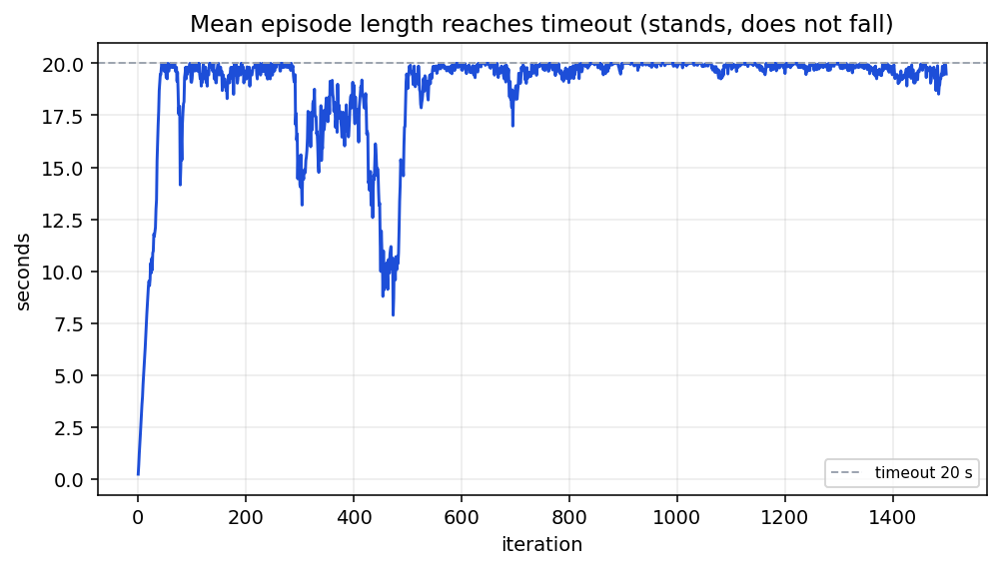
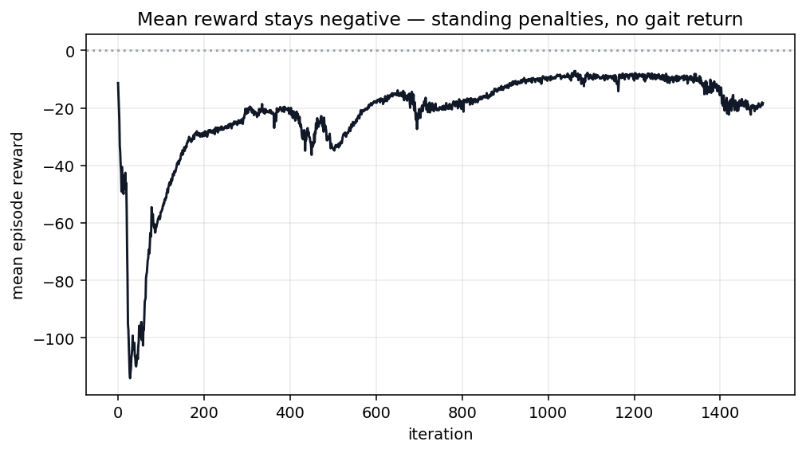
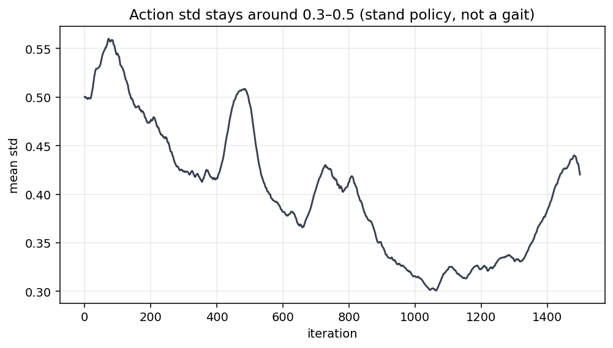

# 2차가 서서만 있는 이유

2026-08-15  
런: `logs/rsl_rl/rough_spot_with_arm/2026-08-15_16-36-59/` · `model_1499.pt` (1500 iter, 약 18분)  
태스크: `Isaac-Velocity-Rough-Spot-Arm-v0` / PLAY `...-Play-v0`  
환경 수: **4096** · PPO · 지형 **plane**

그 전에 같은 날 `2026-08-15_16-27-26` 을 돌렸다가 200 iter에 또 평균 0.23초·`bad_orientation` 100%라 끊음. 아래 숫자는 끊고 스폰·명령을 줄인 **2b** 만.

---

## 1. 보상

한 스텝 보상 = Σ (`weight` × 항).  
양수 = 키우라는 신호, 음수 = 줄이라는 신호(벌점). TensorBoard `Episode_Reward/...` 는 에피소드 합을 20초로 나눈 값이라, 20초를 다 채우면 **스텝 평균 × 가중치** 와 같음.

| 이름 | 가중치 | 하는 일 |
|---|---:|---|
| `track_lin_vel_xy_exp` | +1.0 | 명령한 앞/옆 속도를 맞추면 큼. 공식 `exp(−‖v−cmd‖² / 0.25)`. |
| `track_ang_vel_z_exp` | +0.5 | 명령한 yaw 각속도를 맞추면 큼. |
| `feet_air_time` | +1.0 | 발이 공중에 **0.5초보다 길게** 있다가 착지하면 줌. 짧게 떼면 **음수**. |
| `flat_orientation_l2` | −1.0 | 몸이 기울면 벌점. 1차에선 0이었음. |
| `termination_penalty` | −200 | 타임아웃이 아닌 리셋(넘어짐) 한 번에 큰 벌점. 1차에 없음. |
| `lin_vel_z_l2` | −2.0 | 몸통이 위아래로 튀면 벌점. |
| `ang_vel_xy_l2` | −0.05 | 몸통이 앞뒤/좌우로 구르면 벌점. |
| `dof_torques_l2` | −0.0002 | 다리 모터가 세게 쓰면 벌점. |
| `dof_acc_l2` | −2.5e−7 | 관절이 급가속하면 벌점. |
| `action_rate_l2` | −0.01 | 이번 행동과 직전이 많이 다르면 벌점. |
| `undesired_contacts` | −1.0 | 허벅지·엉덩이·팔이 땅에 세게 닿으면 벌점. |
| `dof_pos_limits` | −1.0 | 관절이 한계를 넘으면 벌점. |
| `arm_joint_deviation` | −1.0 | 팔이 접힌 자세에서 벗어나면 벌점. |

명령 (`UniformVelocityCommand`, 10초마다 다시 뽑음):

| | 값 |
|---|---|
| `lin_vel_x`, `lin_vel_y`, `ang_vel_z` | 각각 **(−0.5, 0.5)** |
| `rel_standing_envs` | 0.1 → 10%는 명령 0 (제자리) |
| `heading_command` | False. yaw는 각속도 명령을 직접 줌. 목표 각도는 없음. |
| 성공 판정 | `error_vel_xy < 0.5` 이면 success |

에피소드를 중간에 끊는 것:

| 이름 | 하는 일 |
|---|---|
| `time_out` | 20초 버티면 정상 종료. |
| `bad_orientation` | 기울기 약 57도 넘으면 리셋. |
| `base_contact` | 몸통·팔이 땅에 세게 닿으면 리셋. |

---

## 2. 화면 · 그래프 (먼저 봄)

PLAY `model_1499.pt`, 평지 16대. 1차처럼 계단에 안 올라감. 네 발은 땅에 붙어 있고, 앞으로 안 감.



\* 가로축 전부 iteration. 길이·종료·보상·걸음 항·행동 std.






---

## 3. 한 줄

1차는 **빨리 죽는 쪽**을 배움. 2차는 **안 죽고 안 걷는 쪽**을 배움.

- 화면: 평지에서 20초 동안 제자리. 다리 걸음 없음.
- 평균 에피소드 길이 마지막 **974 스텝 = 19.5초**. 제한 20초. 95%가 `time_out`.
- `bad_orientation` 4.3%. 1차 99.9%와 반대.
- `track_lin_vel_xy_exp` 끝 **0.62**. 가만히 서 있을 때 이론값 **약 0.60** 과 같음.
- `feet_air_time` 1500 iter 내내 **음수**. 0.5초 넘는 공중 시간 없음.
- 속도 오차 `error_vel_xy` 끝 **0.33**. 명령 크기의 기댓값 0.34 와 같음. 로봇 속도가 0이라는 뜻.

걷는 걸 배운 게 아님. **서서 명령을 무시해도 점수가 나오게 명령을 작게 준 것임.**

---

## 4. PLAY 마커 — 화살표랑 파란 원

Isaac Lab 속도 명령 `debug_vis=True` 가 몸통 위 0.5 m 에 화살표 두 개를 그림.

| 보이는 것 | 코드 | 의미 |
|---|---|---|
| 초록 화살표 (노란 로봇·조명에선 노랗게 보이기도 함) | `goal_vel_visualizer` 초록 | **명령한** 앞/옆 속도. 길이 ∝ ‖cmd_xy‖ |
| 파란 원/구 | `current_vel_visualizer` 파랑 | **실제** 몸통 앞/옆 속도. 길이 ∝ ‖v_xy‖ |

화살표 USD의 길이 축만 속도에 비례해서 늘림. 실제 속도가 0이면 길이가 0이 되어 **납작한 원/구**로 보임. 두 마커는 같은 점(몸통 위)에 그려서, 안 움직이면 초록 화살표 뿌리에 파란 원이 **겹침**.

명령은 10초마다 다시 뽑음. 초록 화살표 방향이 바뀌는 게 “도는 것”으로 보임. 로봇 yaw가 따라가는 게 아님. `heading_command=False` 라서 목표 각도 원도 없음.

정리: 화살표가 있으니 보행 명령은 들어가 있음. 원이 겹쳐 있으면 **실제 속도 ≈ 0**. 화면과 그래프가 같음.

---

## 5. 0.62 는 걸음이 아님

`track_lin_vel_xy_exp = exp(−‖v − cmd‖² / 0.25)`.

가만히 서면 `v=0`. 명령은 90%가 (−0.5, 0.5)² 균등, 10%는 (0,0).  
그 상태에서 기댓값 ≈ **0.60**. 학습 끝 값 **0.617**.

`error_vel_xy` 끝 0.33 ≈ 명령 크기 기댓값 0.34. 로봇이 명령을 따라간 게 아니라, **오차 = 명령 자체**.

`success_rate` 끝 **88%** 도 걸음이 아님. 성공 기준이 `error_vel_xy < 0.5`. 명령 최댓값이 0.5라서 서 있어도 거의 성공으로 침.

Isaac Lab 팔 없는 Spot 평지 예시는 앞속도 명령을 **(−2, 3) m/s**. 거기선 서 있으면 `exp(−2²/0.25) ≈ 0`. 걸을 수밖에 없음. 이번엔 명령을 ±0.5 로 줄여서, 서는 게 국소 최적임.

`track_ang_vel_z_exp` 끝 0.32. 가중치 0.5를 감안하면 항 자체는 ~0.64. 가만히 + yaw 명령 ±0.5 의 기댓값 0.77 보다 조금 낮음. 제자리에서 몸이 약간 흔들린 정도.



\* `Episode_Reward/<이름>`



\* `Metrics/base_velocity/error_vel_xy` 가 0.34 근처에서 안 내려감



\* 기준 0.5 m/s 이라 서서도 높게 나옴

---

## 6. 왜 서는 쪽으로 굳었는지

1차를 고치려고 넣은 장치가, 이번엔 **안 넘어지는 정책**을 정답으로 만듦.

1. **명령이 작음.** 서서도 추적 점수 0.6. 한 걸음 떼다 넘어지면 `termination_penalty` −200. 수지가 안 맞음.
2. **`termination_penalty` −200.** 1차의 “빨리 죽어서 벌점 덜 쌓기”는 막음. 대신 “절대 안 넘어지게 얼어 있기”가 이득.
3. **`feet_air_time`.** 착지 때 `(공중시간 − 0.5초)` 를 줌. 0.5초보다 짧게 떼면 음수. 제자리 접지 노이즈·짧은 발버둥은 벌점. 1500 iter 동안 한 번도 플러스가 안 됨.
4. **`action_rate_l2` −0.01.** 관절 목표를 바꾸면 벌점. 기본 자세에 붙어 있는 게 쌈.
5. **다리 PD Kp=150.** 행동 0 이면 기본각을 세게 붙잡음. 2차 전 PD-hold 5초 기립이 통과한 이유이자, 정책이 안 싸워도 서는 이유.
6. **스폰을 고정함.** 관절 스케일 (1,1), 초기 속도 0, 푸시·질량 랜덤 끔. 나오자마자 안 넘어짐. 기립은 공짜, 걸음은 모험.

iter 50 에 길이가 이미 20초. 그 다음 1500 iter 는 같은 제자리를 다듬음.  
중간(대략 300~500)에 `base_contact` 가 잠깐 50%까지 올라감. 움직이려다 몸통이 찍힌 구간. 곧 다시 서서 타임아웃으로 돌아옴.



\* 끝: `time_out` 95%, `bad_orientation` 4%, `base_contact` 0.8%



\* 파랑 = 초. 점선 = 제한 20초



\* 20초를 버티니 벌점이 쌓여 리턴은 음수. 1차처럼 “짧아서 덜 음수”는 아님.



\* `Policy/mean_std` 0.50 → 0.42. 노이즈를 줄이며 제자리 자세를 굳힘.

끝 시점 항:

| 항 | 가중치 | 끝 값 | 읽기 |
|---|---:|---:|---|
| `track_lin_vel_xy_exp` | +1.0 | **0.62** | 서서 얻는 점수와 같음. 걸음 아님 |
| `track_ang_vel_z_exp` | +0.5 | 0.32 | yaw도 거의 안 맞춤 |
| `feet_air_time` | +1.0 | **−0.019** | 긴 걸음 없음. 짧은 접지 변동만 |
| `flat_orientation_l2` | −1.0 | −0.065 | 거의 수평 |
| `termination_penalty` | −200 | −0.006 | 거의 안 넘어짐 |
| `dof_torques_l2` | −0.0002 | −0.95 | 서서 PD가 토크를 씀. 20초라 절대값이 큼 |
| `action_rate_l2` | −0.01 | −0.051 | 행동을 잘 안 바꿈 |
| `arm_joint_deviation` | −1.0 | −0.047 | 팔 stow는 유지 |
| `undesired_contacts` | −1.0 | ≈ 0 | 허벅지·팔이 땅에 안 찍힘 |

---

## 7. 뒷다리가 더 앉아 보이는 이유

화면의 뒷무릎이 앞보다 접힌 건 맞음. 그게 이번에 새로 배운 COM 보정이라 보긴 이름.

기본 자세가 이미 그렇게 넣음. Isaac Lab Spot 예시와 같음.

| 관절 | 앞 | 뒤 |
|---|---|---|
| `hip_x` | L +0.1 / R −0.1 | 같음 (밖으로 벌림) |
| `hip_y` | **0.9** | **1.1** |
| `knee` | −1.5 | −1.5 |

`hip_y` 가 클수록 허벅지를 더 접음 → 뒤가 더 낮음. 팔 없는 Spot USD 예시도 이 숫자.

팔은 앞으로 뻗은 게 아님. stow: 첫 링크가 등 위로 눕고, 팔꿈치가 접혀 그리퍼가 몸 **앞쪽** 에 옴. 무게는 등판 + 앞쪽 그리퍼에 나뉨. 앞으로 확 쏠린 매니퓰레이터는 아님.

그래서 “팔이 앞이라 뒤를 앉히는 게 맞다”는 직관은 방향은 맞을 수 있음. 다만 지금 자세의 대부분은 **기본각 1.1 / 0.9** 이고, 정책이 COM을 새로 푼 증거는 `feet_air_time`·속도 오차에 없음.

---

## 8. 1차에서 바꾼 것 / 이번에 생긴 것

| | 1차 | 2차 (2b) |
|---|---|---|
| 지형 | rough 계단 | **plane** |
| 환경 수 | 2048 | **4096** |
| 다리 PD | implicit, Kp=20 (실제 0) | explicit DelayedPD **150 / 4** |
| `hip_x` | 전부 0 | L+0.1 / R−0.1 |
| `flat_orientation_l2` | 0 | **−1** |
| `termination_penalty` | 없음 | **−200** |
| 스폰 속도 | xy ±0.5 | **0** |
| 관절 리셋 | 0.8~1.2 → 0.9~1.1 | **(1, 1)** 고정 |
| 속도 명령 | ±1.0, heading 켜짐 | **±0.5**, heading 끔 |
| `init_std` | 1.0 | 0.5 |
| 평균 에피소드 | 0.28초 | **19.5초** |
| `track_lin_vel_xy_exp` | 0.002 | 0.62 (서서 나오는 값) |
| PLAY | 계단 꼭대기에서 전복 | 평지에서 제자리 |

2차 전 체크리스트(평지 PD 기립, Kp, 기립 벌점, 4096, resume 안 함)는 지킴.  
빠진 것: **서서 얻는 추적 점수가 걸어서 얻는 점수보다 낮아야 함.** 명령을 ±0.5 로 줄인 순간 그 조건이 깨짐.

---

## 9. 이렇게 읽으면 안 됨

- `track_lin_vel_xy_exp` 0.62 니까 속도 추종이 됨 → 서서 나오는 기댓값과 같음.
- `success_rate` 88% 니까 과제가 성공 → 성공 기준 0.5가 명령 최댓값과 같음.
- 화살표가 있으니 걷고 있음 → 초록은 명령, 파란 원이 겹치면 실제 속도 0.
- 화살표가 도니 yaw를 배움 → 10초마다 명령을 다시 뽑아서 화살표만 회전.
- 뒷다리를 앉혔으니 COM을 품 → 기본 `hip_y` 뒤 1.1.
- `feet_air_time` 가중치를 올리면 걸음 → 지금 항이 음수. 올리면 짧은 발버둥 벌점만 커짐. 공중 0.5초가 나오게 명령을 키우는 쪽이 먼저.
- 평균 보상이 −18이라 실패만 함 → 20초 동안 토크·자세 벌점이 쌓인 값. 기립은 됨.
- `model_1499` 를 버리고 처음부터 → 1차와 다름. 이건 **기립 정책**. 명령을 키운 3차에서 이어 돌릴 후보는 됨. 같은 ±0.5 로 이어 돌리면 계속 섬.

---

## 10. 3차 전에 (이 순서)

1. 속도 명령을 키움. 최소 `lin_vel_x` 를 **(0.0, 1.5)** 또는 **(−1.0, 1.5)**. 서서 `exp(−1²/0.25) ≈ 0.02` 가 되게. Lab Spot 평지는 (−2, 3).
2. 성공 기준 `vel_xy_success_threshold` 를 명령 스케일에 맞게. ±0.5 / 0.5 조합은 안 씀.
3. `feet_air_time` 은 음수가 안 나오게 `max(0, air−0.5)` 쪽이 안전. 짧은 접지 벌점으로 걸음을 막지 말 것.
4. 기립 PD·평지·`termination_penalty` 는 유지. 1차로 돌아가지 말 것.
5. 2b `model_1499` 에서 **명령을 키운 채** resume 가능. 같은 설정으로 1500 더 돌리면 안 됨.
6. 200 iter 게이트: `error_vel_xy` 가 명령 기댓값(서서 0.3대) **아래로** 내려가는지, `feet_air_time` 이 플러스가 되는지. `track_lin_vel` 숫자만 보지 말 것.
7. 그게 보이면 그때 rough.

3차 끝나면 `docs/training/round-04/` 를 새로 만듦. 이 폴더는 덮어쓰지 않음.

---

## 11. 다시 뽑기

숫자: [data/round2b_metrics.json](data/round2b_metrics.json)

```bash
source scripts/isaaclab_env.sh
python docs/training/round-03/export_tensorboard_figures.py

tensorboard --logdir logs/rsl_rl/rough_spot_with_arm/2026-08-15_16-36-59
```
