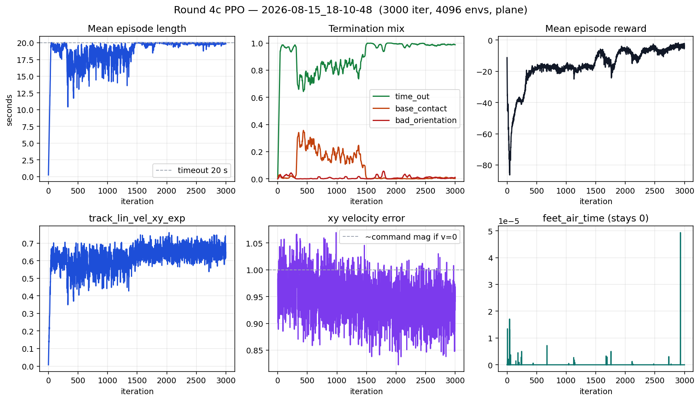
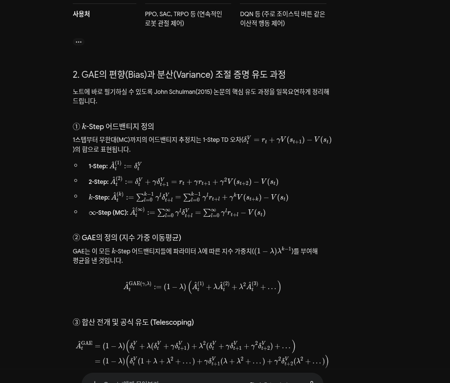
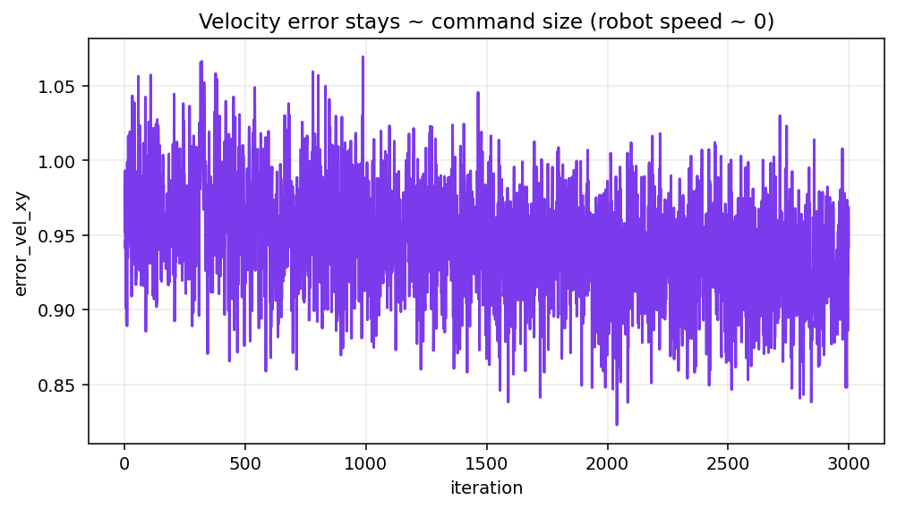
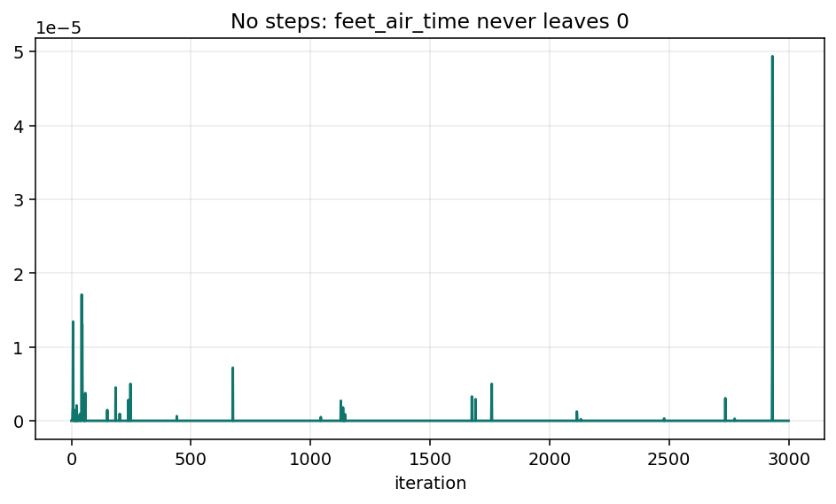
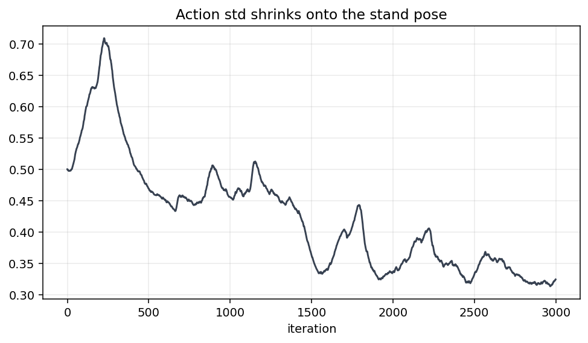

# 4차가 서서만 있는 이유

2026-08-15  
런: `logs/rsl_rl/rough_spot_with_arm/2026-08-15_18-10-48/` · `model_2999.pt` (3000 iter)  
환경 수 4096 · 평지 · 처음부터 (기립 체크포인트 resume 안 함)

PLAY에서 중심은 잡고 있음. 한 발도 안 뗌. 초록 화살표(명령)는 있는데 파란 원은 실제 속도 ≈ 0.

같은 날 끊은 런:
- `17-13-55` — 2차 기립 가중치에서 명령만 키움. std가 이미 작아서 안 움직임.
- `17-40-26` — `init_std=0.8`, action scale 0.25. 200 iter에 0.35초 전복.
- `17-47-20` — 기립 안전한 std + 걷기 명령. 다시 기립으로 굳음.

아래 숫자는 **끝난 4c** (`18-10-48`) 만.

---

## 1. 보상 (4c에 실제로 쓰인 값)

| 이름 | 가중치 | 하는 일 |
|---|---:|---|
| `track_lin_vel_xy_exp` | +1.5 | `exp(−‖v−cmd‖² / 1.0)`. std를 0.5에서 1.0으로 넓힘. |
| `track_ang_vel_z_exp` | +0.5 | yaw 각속도. |
| `feet_air_time` | +1.5 | 공중 **0.5초** 넘어야 점수. 짧게 떼면 0 (음수 클램프). |
| `flat_orientation_l2` | −1.0 | 기울면 벌점. |
| `termination_penalty` | −200 | 넘어지면 한 번 큼. |
| `action_rate_l2` | −0.01 | 관절 목표를 바꾸면 벌점. |
| `dof_torques_l2` | −0.0002 | 토크 벌점. Kp=150이면 서서도 큼. |

명령: `lin_vel_x` **(0.5, 1.5)** m/s, 옆 ±0.4, yaw ±0.8. 10%는 제자리 명령.  
행동: `목표각 = 기본각 + 0.2 × a`. 다리 PD Kp=150 / Kd=4.

---

## 2. 화면 · 그래프





---

## 3. 한 줄

2차가 **작은 명령 때문에** 서서 점수를 받음. 4차는 명령을 키웠는데도 **걸을 이유가 보상·행동 쪽에 없음.**

- 에피소드 끝 **19.8초**, `time_out` **99%**. 안 넘어짐.
- `error_vel_xy` 끝 **0.94**. 명령 크기 ≈ 1. 몸통 속도 ≈ 0.
- `feet_air_time` 3000 iter 내내 **0**. 발이 0.5초 넘게 떨어진 적이 없음.
- `track_lin_vel_xy_exp` 0.65. std=1.0 에서 서서 `exp(−1)≈0.37` 보다 조금 높음. 미끄러지거나 흔들린 정도. 걸음 아님.
- `Policy/mean_std` 0.50 → **0.32**. 제자리 자세를 정답으로 굳힘.

---

## 4. 무엇이 틀렸는지

### 지수 추적은 v=0 에서 거의 안 밀어 줌

`r = exp(−‖v−cmd‖² / std²)`, std=1, cmd≈1, v=0 → r≈0.37.  
v가 0 → 0.1 m/s 가 돼도 r≈0.44. **첫 10 cm/s 의 이득이 0.07.**  
그 대가로 자세를 바꾸면 `action_rate` 벌점, 넘어지면 −200, 토크 벌점. PPO가 고른 최선은 기본각에 붙어 있기.

2차에서 명령을 ±0.5 로 줄인 건, 서서 r≈0.60 이 나오게 해서 **걷기 유인을 없앤 것**.  
4차에서 명령을 키운 건 맞음. 그런데 커널이 여전히 “이미 명령 근처일 때만” 큼. 정지 상태의 기울기가 부족함.

### 행동 스케일 0.2 rad 로는 걸음 자세가 안 나옴

정책이 고를 수 있는 관절은 기본 기립각 ±0.2 rad (약 11도).  
Spot 한 걸음은 hip_y / knee 가 그보다 훨씬 크게 움직임.  
Kp=150 이 그 작은 목표를 세게 붙잡아서, 화면처럼 **중심은 좋고 다리는 잠김.**

탐색만 키운 4a (`init_std=0.8`, scale 0.25) 는 같은 작은 범위 안에서 무작위로 흔들다 넘어짐. 보폭을 연 게 아님.

### `feet_air_time` 0.5초는 닭과 달걀

점수는 발이 **이미** 0.5초 떠 있어야 줌. 안 걷는 정책은 평생 0.  
짧게 떼면 예전엔 음수였고, 4차에선 0으로 잘랐을 뿐 **들어 올리라는 신호는 없음.**

### 기립 체크포인트 resume

3차는 2차 `model_1499` 에서 이어서 1500 iter. std 0.42에서 시작해 더 줄어듦.  
이미 “움직이지 마” 정책에 걷기 명령만 넣은 것임.

---

## 5. 끝 숫자 (4c)

| 항 | 끝 |
|---|---:|
| 에피소드 | 19.8초 |
| `time_out` | 0.987 |
| `track_lin_vel_xy_exp` | 0.65 |
| `error_vel_xy` | 0.94 |
| `feet_air_time` | 0 |
| `success_rate` | 0.01 |
| `mean_std` | 0.32 |







---

## 6. 이렇게 읽으면 안 됨

- 중심을 잡았으니 보행 학습 성공 → 기립만 성공.
- `track_lin_vel` 0.65 니까 속도를 맞춤 → 서서 나오는 값 + 약간 흔들림.
- 명령을 더 키우면 걸음 → 이미 0.5–1.5. 문제는 명령 크기가 아님.
- `model_2999` 에서 resume 하면 걷기 시작 → std가 잠김. 5차는 처음부터.
- `feet_air_time` 가중치만 올리면 걸음 → 발이 안 떨어지면 0 × 가중치.

---

## 7. 5차에서 바꾸는 것

1. **`track_lin_vel_xy_dot` = cmd_xy · v_xy.** 서 있으면 0. 명령 방향으로 움직이기 시작하는 즉시 점수. 지수 커널과 같이 씀.
2. **action scale 0.2 → 0.4.** 한 걸음에 필요한 관절 범위를 염. `init_std=0.4` 로 초기 흔들림은 4a보다 작게 (0.16 rad rms).
3. **`feet_air_time` 임계 0.5초 → 0.1초.** 짧은 발 들림도 점수.
4. `action_rate` −0.01 → **−0.005**, 토크 벌점 절반. 기립 PD·평지·넘어짐 −200·명령 0.5–1.5 는 유지.
5. `18-10-48/model_2999` resume 안 함.

200 iter 게이트: 길이가 수 초 이상(전복으로 안 돌아감) **그리고** `error_vel_xy` 가 1.0에서 내려가거나 `track_lin_vel_xy_dot` / `feet_air_time` 이 0에서 떠야 함. 길이만 20초면 또 기립.

---

## 8. 다시 뽑기

```bash
python docs/training/round-04/export_tensorboard_figures.py
tensorboard --logdir logs/rsl_rl/rough_spot_with_arm/2026-08-15_18-10-48
```
