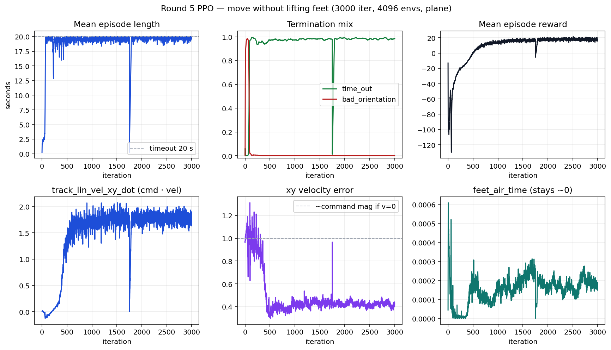
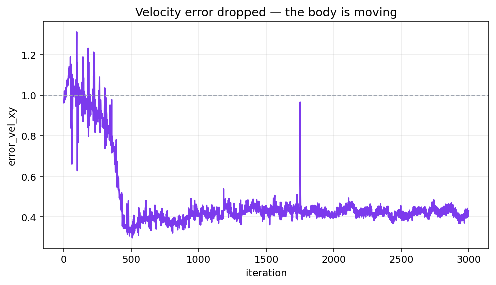
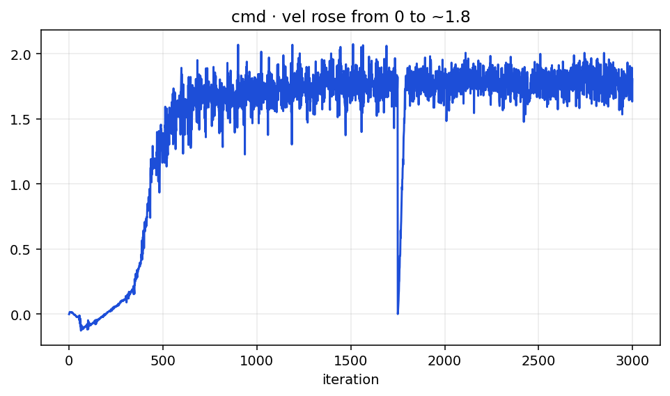
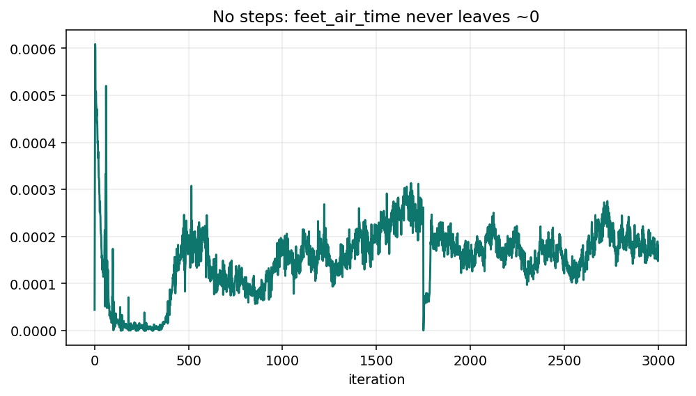

# 5차가 움직이기만 하고 안 걷는 이유

2026-08-17  
런: `2026-08-17_12-43-51` (0–1750, 중간에 죽음) → `2026-08-17_13-23-37` (1750–2999 resume) · `model_2999.pt`  
환경 수 4096 · 평지 · 처음부터 (4차 기립 체크포인트 resume 안 함)

4차는 중심만 잡고 속도 0. 5차는 **몸통 속도가 명령 쪽으로 붙음.** 다만 `feet_air_time` 은 3000 iter 내내 0. 걸음이 아니라 발을 붙인 채 미끄러진 것.

---

## 1. 보상 (5차에 실제로 쓰인 값)

| 이름 | 가중치 | 하는 일 |
|---|---:|---|
| `track_lin_vel_xy_exp` | +1.0 | `exp(−‖v−cmd‖² / 1.0)`. |
| `track_lin_vel_xy_dot` | +1.5 | `cmd_xy · v_xy`. 서 있으면 0. 명령 방향으로 움직이면 즉시 점수. |
| `track_ang_vel_z_exp` | +0.5 | yaw 각속도. |
| `feet_air_time` | +1.5 | 공중 **0.1초** 넘으면 점수. 짧게 떼면 0. |
| `flat_orientation_l2` | −1.0 | 기울면 벌점. |
| `termination_penalty` | −200 | 넘어지면 한 번 큼. |
| `action_rate_l2` | −0.005 | 관절 목표를 바꾸면 벌점. |
| `dof_torques_l2` | −0.0001 | 토크 벌점. |

명령: `lin_vel_x` **(0.5, 1.5)** m/s, 옆 ±0.4, yaw ±0.8. 10%는 제자리.  
행동: `목표각 = 기본각 + 0.4 × a`. 다리 PD Kp=150 / Kd=4.  
마찰 랜덤 (0.5, 1.25).

---

## 2. 그래프

---

## 3. 한 줄

4차가 **안 움직인 이유**는 지수 추적이 정지 상태에서 기울기가 없고, 관절 범위가 한 걸음보다 작았음.  
5차는 그 두 개를 고쳤고, **움직임은 나옴.** 그다음 최적이 걸음이 아니라 **다리 잠근 채 미끄러지기**.

- 에피소드 끝 **19.8초**, `time_out` **98.5%**. 안 넘어짐.
- `error_vel_xy` 끝 **0.43**. 4차는 0.94 (명령 크기 ≈ 1, 속도 ≈ 0). 지금은 몸통이 명령의 절반 이상을 냄.
- `track_lin_vel_xy_dot` 끝 **1.81**. 서서 나오는 값 0이 아님.
- `feet_air_time` 3000 iter 내내 **~0**. 0.1초 넘게 떨어진 발이 없음.
- `success_rate` **0.09**. 성공 기준이 오차 0.35라서, 0.43이면 거의 실패. 속도는 나는데 목표엔 못 붙음.
- `dof_pos_limits` **−0.66**. 관절을 한계까지 밀어 붙임. 보폭이 아니라 다리를 뻗은 채 미끄러지는 쪽에 가깝음.

---

## 4. 무엇이 틀렸는지

### cmd·vel 은 미끄러짐과 걸음을 구분하지 않음

`r = cmd · v`. 발이 땅에 붙어 있어도 몸통이 1 m/s 로 가면 점수가 같음.  
4차에서 막혀 있던 “첫 1 cm/s” 는 이 항이 열어 줌. 그 다음 싼 해답이 **PD로 다리를 잠그고 바닥을 미끄러지는 것**.

지수 추적 `exp` 도 속도만 보면 됨. 0.80 은 걸었다는 뜻이 아님.

### `feet_air_time` 은 이미 뜬 발만 점수

임계를 0.5초 → 0.1초로 낮춤. 그래도 발이 안 떨어지면 0 × 가중치.  
들어 올리라는 **기울기**가 없음. 미끄러지는 정책은 평생 0.

접촉 센서가 완전히 죽은 건 아님. `undesired_contacts` 가 −0.027 로 잡힘. 허벅지·팔 리포트는 있음. 발이 안 뜬 쪽이 맞음.

### 마찰 0.5 가 미끄러짐을 싸게 만듦

스폰 때 마찰을 (0.5, 1.25) 로 랜덤. 0.5 인 환경에선 잠긴 다리로도 1 m/s 가 나옴.  
걸음을 안 배워도 `cmd · v` 점수를 받을 수 있음.

### 5차 체크포인트를 이어서 걸음을 넣으면 안 됨

`mean_std` 0.40 → **0.27**. 미끄러지는 자세로 굳음.  
3차가 기립 정책에 걷기 명령만 넣은 것과 같음. 미끄러짐 벌점을 뒤에 얹으면 움직임을 줄여 **다시 기립**으로 갈 가능성이 큼.

---

## 5. 끝 숫자

| 항 | 4c 끝 | 5차 끝 |
|---|---:|---:|
| 에피소드 | 19.8초 | 19.8초 |
| `time_out` | 0.987 | 0.985 |
| `error_vel_xy` | 0.94 | **0.43** |
| `track_lin_vel_xy_dot` | (없음) | **1.81** |
| `track_lin_vel_xy_exp` | 0.65 | 0.80 |
| `feet_air_time` | 0 | 0 |
| `success_rate` | 0.01 | 0.09 |
| `mean_std` | 0.32 | 0.27 |

---

## 6. 이렇게 읽으면 안 됨

- `error_vel_xy` 0.43 이니까 보행 성공 → 몸통만 움직임. 발은 안 뗌.
- `track_lin_vel` 0.80 이니까 속도를 맞춤 → 미끄러져도 같은 숫자.
- `feet_air_time` 가중치만 올리면 걸음 → 발이 안 떨어지면 0.
- `13-23-37/model_2999` 에서 resume 하면 걸음 → std가 미끄러짐에 잠김.
- Kp를 지금 낮추면 걸음 → 1차에서 기립이 깨졌던 축. 보행 유인을 먼저 고침.

---

## 7. 6차에서 바꾸는 것

움직임 보상(`cmd · v`)은 유지. 미끄러짐이 걸음보다 싸지 않게 만듦.

1. **`feet_slide`.** 접지한 발의 xy 속도 벌점. 몸통이 0.4 m/s 넘을 때만. 제자리 흔들림은 안 깎음.
2. **`foot_clearance`.** 걷기 명령이 있을 때 발 구 높이. 땅에 붙어 있으면 0. 정지 상태에서도 발을 들면 점수.
3. **마찰 1.0 고정.** (0.5, 1.25) 랜덤을 끔.
4. 기립 PD 150/4, 평지, 넘어짐 −200, 명령 0.5–1.5, action scale 0.4, `cmd · v` 는 유지.
5. `13-23-37/model_2999` resume 안 함. 처음부터 3000 iter.

6a (`13-45-52`) 는 slide를 항상 켜 둔 채 200 iter에 다시 기립이라 끊음. 마찰 1.0 이라 미끄러지지도 못하고, 발 들림 항은 발 xy 속도에 막혀 0.

200 iter 게이트: 길이가 수 초 이상 **그리고** `foot_clearance` / `feet_air_time` 이 0에서 떠나거나 `error_vel_xy` 가 1.0에서 내려가야 함.  
`cmd · v` 만 높고 발 항이 0이면 또 미끄러짐. 길이만 20초면 또 기립.
