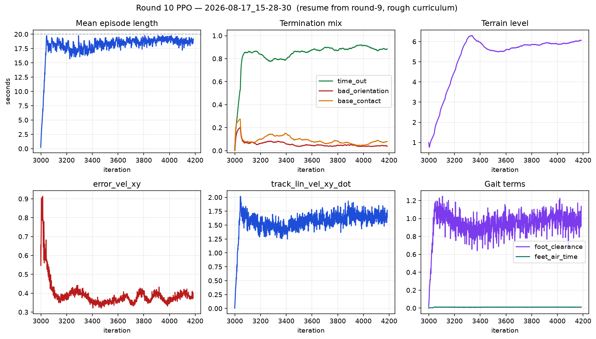

# 10차 — 평지 걸음 위에 험지 커리큘럼

9차는 평지에서 걷는다. PLAY 피라미드(오르막·내리막)는 실패.  
1차처럼 험지를 처음부터 최대 난도로 넣으면 서기도 전에 죽음.

## 이번 한 가지

9차 `model_2999` 에서 이어서, 지형만 켬.

- Lab 험지 생성기 10×20 (legged_gym과 같은 격자). 패치 8 m → 약 80×160 m + 테두리.
- 커리큘럼 **레벨 0부터.** 멀리 가면 어려운 칸, 못 가면 쉬운 칸.
- 피라미드 첫 칸 단 높이 5 cm. 최대 23 cm는 커리큘럼이 올려 줌.
- 보상·PD 80/3·명령은 9차와 같음.

테스트 PLAY는 `spot_arm_rough_test_cfg.py` 에서 5×5가 아니라 **10×20**.

---

## 결과

런: `logs/rsl_rl/rough_spot_with_arm/2026-08-17_15-28-30/` · iter 3000 → 4186 · `model_4150.pt`
3000 iter를 걸었지만 1187에서 끊음.



| 항 | 9차 끝 (평지) | 10차 끝 (험지) |
|---|---:|---:|
| 지형 레벨 | (없음) | **6.06** / 9 |
| 에피소드 | 20초 | 19.17초 |
| `time_out` | 0.995 | 0.885 |
| `base_contact` | 0.002 | 0.078 |
| `bad_orientation` | 0.003 | 0.038 |
| `error_vel_xy` | 1.02 | **0.378** |
| `track_lin_vel_xy_dot` | 2.59 | 1.77 |
| `foot_clearance` | 1.02 | 1.14 |
| `feet_air_time` | 0.012 | 0.011 |
| `success_rate` | 0.11 | **0.00** |
| `mean_std` | — | 0.77 → **1.01** |

### 된 것

험지에서 안 죽고 감. 레벨 0에서 6까지 올라감. `error_vel_xy` 가 1.02 → 0.38 로 내려감 (험지 명령이 평지보다 잘 맞음).
1차처럼 계단에서 즉사하지 않음. 이 부분은 커리큘럼이 의도대로 동작.

### 안 된 것 (11차의 이유)

1. **레벨 6에서 멈춤.** iter 3350 이후 800 iter 동안 5.5–6.1 사이. 오르지 못하는 평형.
2. **`feet_air_time` 0.011.** 7차부터 10차까지 변화 없음. 공중 0.1초를 넘는 스윙이 사실상 없음.
3. **`success_rate` 0.** 오차 0.378 이 기준 0.35 를 계속 넘김.
4. **`mean_std` 0.77 → 1.01, entropy 13.4 → 16.7.** 정책이 좁혀지지 않고 넓어짐. 수렴 방향이 아님.

### 원인 — `foot_clearance` 가 지형 높이를 보상으로 줬음

```python
ground = _FOOT_RADIUS          # 0.036, 세계좌표 상수
lift = clamp((foot_z - ground) / 0.044, 0, 1)
```

평지에선 맞음. 험지 생성기에선 서브지형 원점 z 가 0이 아님:

| 서브지형 | 비중 | 원점 z |
|---|---:|---|
| `pyramid_stairs` | 0.2 | `+(steps+1) × 단높이` (최대 ~+1 m) |
| `pyramid_stairs_inv` | 0.2 | `−(steps+1) × 단높이` (최대 ~−1 m) |
| `boxes` | 0.2 | `+grid_height` |
| `random_rough` / 경사 | 0.4 | 0 |

256환경을 띄워 **행동 0 (가만히 서 있음)** 으로 실측
(`../round-11/check_foot_clearance_reference.py`):

| 서브지형 원점 z | 환경 수 | 세계 z 기준 | 지형 상대 |
|---|---:|---:|---:|
| −0.05 m 아래 | 76 | 0.000 | 0.001 |
| +0.05 m 위 | 180 | **0.976** | 0.041 |
| 전체 | 256 | **0.686** | 0.029 |

발을 하나도 안 들었는데 0.686. 가중치 2.0을 곱하면 학습 기록의 `foot_clearance` 1.14 가 거의 다 이 값임.

- 계단 위(70%): 항이 1.0에 붙어 있어서 **발을 들어도 더 받을 게 없음.**
- 역계단(30%): 항이 0에 붙어 있어서 **발을 들어도 받을 수 있는 게 없음.**

9차 평지 걸음을 만든 유일한 신호가 험지에서는 양쪽 다 죽음. `feet_air_time` 이 4라운드째 0인 이유,
레벨 6에서 멈춘 이유, `mean_std` 가 커진 이유가 다 여기로 모임.
