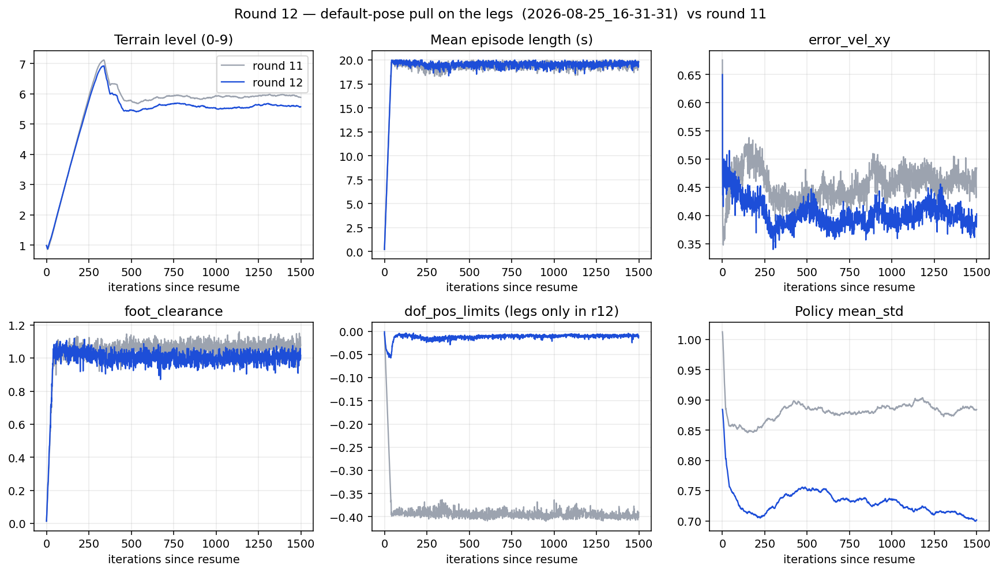
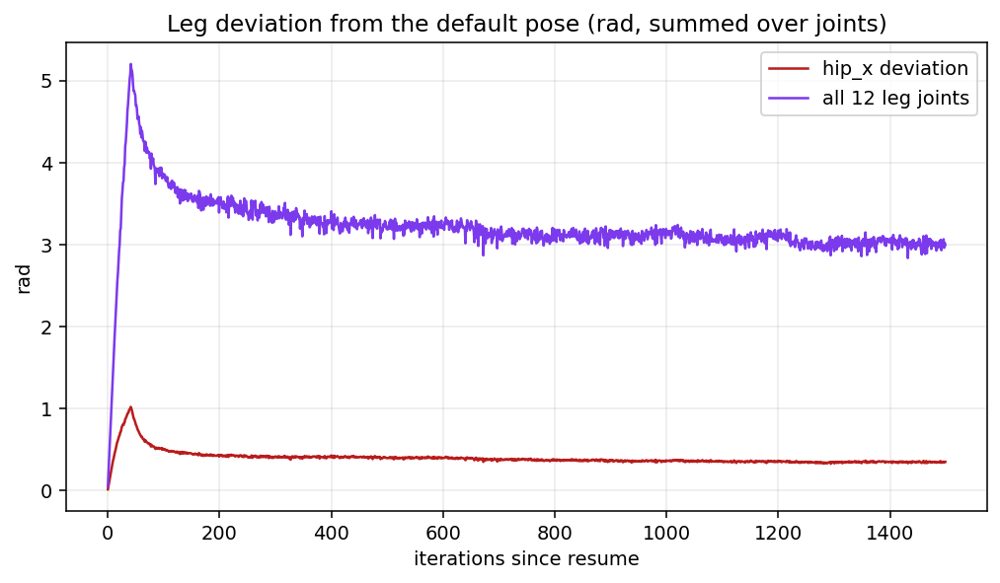
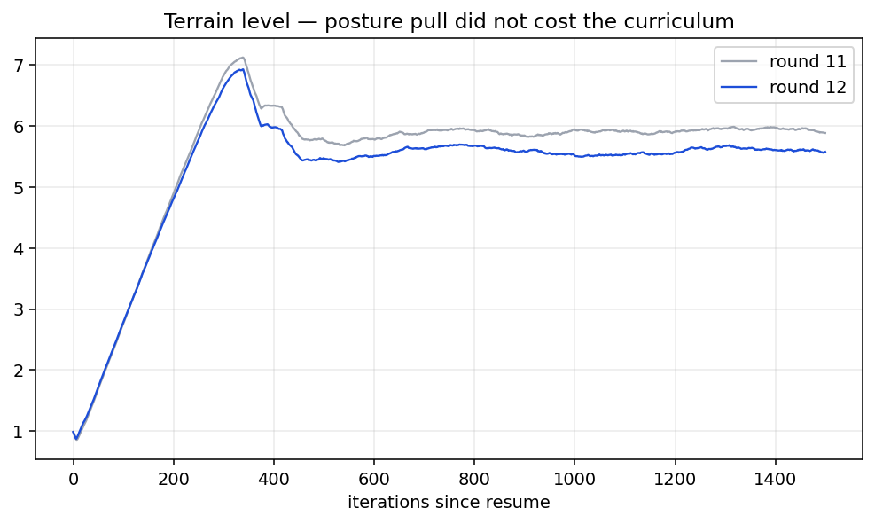

# 12차 — 다리를 기본 자세로 당기기

11차는 험지 레벨 5.9 에서 20초를 버틴다. 그런데 자세가 로봇 같지 않다.
[11차 롤아웃 실측](../round-11/02-롤아웃-자세결함.md) 에서 나온 것:

| 본 것 | 실측 |
|---|---|
| 무릎을 거의 안 펴고 다님 | 무릎 평균 **−2.08 ~ −2.27** (기본 −1.5). 가동폭은 0.47–0.90 rad 으로 최대 |
| 네 발이 배 밑에 모임 | 앞 스탠스 폭 **0.063 m** = 기준 0.332 m 의 **19%**. 앞발 구가 서로 관통 |
| hip 으로만 움직임 | `hip_x` 가 부호를 뒤집음: FL **−0.468** (기본 +0.1), FR **+0.360** (기본 −0.1) |

원인은 하나로 모인다. **다리를 기본 자세로 당기는 항이 없다.**
`arm_joint_deviation` 은 팔에만 있다. 다리는 `hip_x` 를 안쪽으로 접어도, 무릎을 0.7 rad 더 접어도
비용이 0이다. 자기충돌도 꺼져 있어서(`self_collision=False`) 다리끼리 관통해도 아무 일이 없다.

## 이번 묶음 (자세 하나, 노브 셋)

한 번에 하나 규칙을 이번만 묶는다. 세 노브가 다 "기본 자세로 당기기" 한 가지를 향한다.

| 항 | 가중치 | 무엇을 잡나 | 현재 편차 → 예상 벌점 |
|---|---:|---|---|
| `leg_joint_deviation` (신규, 다리 12개) | −0.2 | 웅크림 전반 | 6.66 rad → −1.33 |
| `hip_x_deviation` (신규, `.*_hip_x`) | −1.0 | 스탠스 폭 | 1.68 rad → −1.68 |
| `dof_pos_limits` (다리로 스코프, −1.0 → **−10.0**) | −10.0 | 한계 근처 웅크림 | 0.022 rad → −0.22 |

합계 약 −3.2. 11차 `mean_reward` 24 의 13% 다. 자세를 움직일 만하고 걸음을 지울 정도는 아니다.

`hip_x` 를 더 세게 당기는 이유: 전진 스트라이드에 `hip_x` 는 기여하지 않는다.
가동폭이 0.26–0.49 rad 인데 그게 전부 안쪽으로 치우친 오프셋이다.

### `dof_pos_limits` 를 왜 다리로 스코프했나

이 항에는 `asset_cfg` 가 없어서 19개 관절 전부를 본다. 기본 자세에서의 소프트 한계 위반을 재보면
(`check_joint_limit_penalty.py`):

| 관절 | 기본값 | 소프트 한계 | 위반 |
|---|---:|---|---:|
| `arm_sh1` | −3.120 | [−2.958, 0.340] | **0.162** |
| `arm_el0` | 3.120 | [0.157, 2.985] | **0.135** |
| `arm_f1x` | 0.000 | [−1.492, −0.079] | **0.079** |
| 다리 12개 | — | — | 0.000 |

| | 위반 (rad) |
|---|---:|
| 다리 (정책이 움직일 수 있음) | 0.022 |
| **팔 (PD 고정, 상수)** | **0.376** |
| 10·11차 로그 합계 | 0.398 |

로깅된 0.398 의 **94% 가 팔의 stow 자세**다. 팔은 정책의 행동 공간에 없으니 이 부분은
아무리 벌점을 키워도 줄 수 없는 상수다. 스코프 없이 −10.0 으로 올리면 상수 −3.76 이 얹히고
실제 신호는 −0.22 뿐이다. 다리로 좁히면 −10.0 전부가 정책이 움직일 수 있는 값이 된다.

BD stow 자세가 URDF 한계에 붙어 있어서 생기는 일이다. 자세 자체는 의도한 것이므로 건드리지 않는다.

## 안 바꾸는 것

- 추종 std 1.0, `track_lin_vel_xy_dot` 1.5 → **과속 62% 와 요 흔들림 0.147 rad/s 는 14차.**
  이번에 같이 건드리면 자세 변화와 속도 변화를 구분할 수 없다.
- 명령 0 에서 발 들기 → 14차 후보.
- 자기충돌 → 끈 채로 둠. 켜면 URDF 충돌 형상 겹침으로 스폰이 터질 수 있어 별건으로 본다.
- 지형 커리큘럼, PD 80/3, `foot_clearance` 목표 0.08, `termination_penalty` −200 은 11차와 같음.

resume: `2026-08-25_15-27-52/model_5649.pt` · 4096 환경 · 1500 iter.

## 게이트

11차 끝(iter 5649)과 비교. 자세 지표는 `../round-11/diagnose_gait.py` 로 같은 방식으로 다시 측정.

| 보이면 | 뜻 |
|---|---|
| 앞 스탠스 폭이 0.063 → 0.2 m 대로 올라오고 무릎 평균이 −1.7 대로 올라옴 | 목표. 자세가 잡힘 |
| 지형 레벨이 5.9 를 유지하거나 오름 | 자세를 잡아도 걸음을 안 잃음 |
| 지형 레벨이 4 밑으로 떨어짐 | 벌점이 과함. `hip_x_deviation` 부터 절반으로 |
| 자세는 안 바뀌고 `mean_reward` 만 −3 내려감 | 가중치가 약함. 편차를 줄이는 것보다 벌점을 내는 게 싸다는 뜻 |
| 에피소드가 20초에서 내려가고 넘어짐이 늘어남 | 좁은 스탠스가 실제로 이 정책의 균형에 필요했던 것. 그러면 스탠스는 자기충돌 문제로 되돌림 |

---

## 결과

런: `logs/rsl_rl/rough_spot_with_arm/2026-08-25_16-31-31/` · iter 5649 → 7148 · `model_7148.pt`

### 자세 — 잡혔다

`diagnose_gait.py` 로 11차와 같은 조건(평지 PLAY, 64환경 × 600스텝) 재측정:

| | 기준 | 11차 | 12차 |
|---|---:|---:|---:|
| 앞 스탠스 폭 | 0.332 m | 0.063 m (19%) | **0.395 m (119%)** |
| 뒤 스탠스 폭 | 0.332 m | 0.195 m (59%) | **0.381 m (115%)** |
| `front_left_hip_x` | +0.100 | **−0.468** | **+0.059** |
| `front_right_hip_x` | −0.100 | **+0.360** | **−0.107** |
| `front_left_knee` | −1.500 | −2.110 | **−1.764** |
| `rear_left_knee` | −1.500 | −2.267 | **−1.984** |
| `front_left_hip_y` | 0.900 | 1.414 | **1.106** |
| `rear_left_hip_y` | 1.100 | 1.671 | **1.160** |
| 발까지의 몸통 높이 (앞) | — | 0.328 m | **0.402 m** |

- `hip_x` 의 **부호가 제자리로 돌아왔다.** 네 다리 다 기본값에서 0.04 rad 안쪽.
- 앞발 구 간격이 0.063 → 0.395 m. 관통이 사라졌다 (필요 최소 0.072 m).
- 무릎 편차 0.61–0.77 → **0.26–0.48 rad.** 웅크림의 약 60% 가 빠졌다.
- `hip_y` 편차 0.51–0.63 → **0.06–0.21 rad.** 거의 기본값.
- 몸통이 발 위로 7–9 cm 올라섰다.
- 무릎 가동폭 0.48–0.98 rad (11차 0.47–0.90). **스윙을 잃지 않았다.**

### 걸음 — 잃지 않았다

| | 11차 끝 | 12차 끝 |
|---|---:|---:|
| 지형 레벨 | 5.89 | 5.58 |
| 에피소드 | 19.4초 | 19.8초 |
| `time_out` | 0.943 | **0.955** |
| `base_contact` | 0.033 | **0.026** |
| `bad_orientation` | 0.025 | **0.019** |
| `error_vel_xy` | 0.485 | **0.403** |
| `foot_clearance` | 1.077 | 1.016 |
| `feet_air_time` | 0.0127 | 0.0110 |
| `mean_std` | 0.884 | **0.702** |

지형 레벨은 5.9 → 5.6 으로 사실상 유지. 넘어짐은 줄고, 속도 오차도 줄고, `mean_std` 도 더 좁혀졌다.
**자세를 펴는 대가를 걸음으로 치르지 않았다.**

`Train/mean_reward` 는 24 → 13 으로 내려가지만 보상 함수가 바뀌었으므로 라운드 간 비교 대상이 아니다.
항목별로는 새 벌점 두 개(−0.43, −0.71)와 `dof_pos_limits` 스코프로 회수한 +0.38 의 합이다.

### `dof_pos_limits` 스코프의 확인

| | 11차 (19관절, −1.0) | 12차 (다리 12개, −10.0) |
|---|---:|---:|
| `Episode_Reward/dof_pos_limits` | −0.391 | **−0.012** |

가중치를 10배 올렸는데 값이 1/33 이 됐다. 그 항의 94% 가 정말 팔이었다는 증거다.
다리의 실제 위반은 스텝당 0.0012 rad 수준이다.

### 딸려온 개선 — 서서 발 들기

노린 게 아닌데 좋아졌다:

| | 11차 | 12차 |
|---|---:|---:|
| 설 때 `rear_left` 접지 | **0.011** | **0.793** |
| 설 때 발 하나 이상 뜬 프레임 | 99.7% | **21.5%** |
| 설 때 평균 접지 발 | 2.99 / 4 | **3.77 / 4** |

`leg_joint_deviation` 은 명령으로 게이트되지 않는다. 그래서 명령이 0일 때도 다리를 들고 있으면
기본 자세 편차로 값을 낸다. 비용이 0 이던 자세에 처음으로 값이 붙었다.
아직 21.5% 가 남았고 `rear_left` 만 0.793 으로 다른 발(0.99)보다 낮다. 완전히 없애려면 전용 항이 필요하다.

### 안 고쳐진 것 — 14차

이번에 일부러 안 건드린 것들이 그대로 남았다. 강제 직진 (1.0, 0, 0):

| | 11차 | 12차 |
|---|---:|---:|
| 실제 `vx` (명령 1.0) | 1.625 | **1.520** |
| `\|wz\|` (명령 0) | 0.147 | 0.156 |
| 크랩 각도 | 0.8° | 3.8° |

과속이 62% → 52% 로 조금 줄었을 뿐이다. 예상대로 자세 항으로는 안 잡힌다.
14차는 추종 std 1.0 → 0.5 (Lab 기본) 와 `track_lin_vel_xy_dot` 목발 정리.
13차는 그 전에, GUI에서 본 순간이동·두둥실 — 클립·속도 한도·트로트 항.
