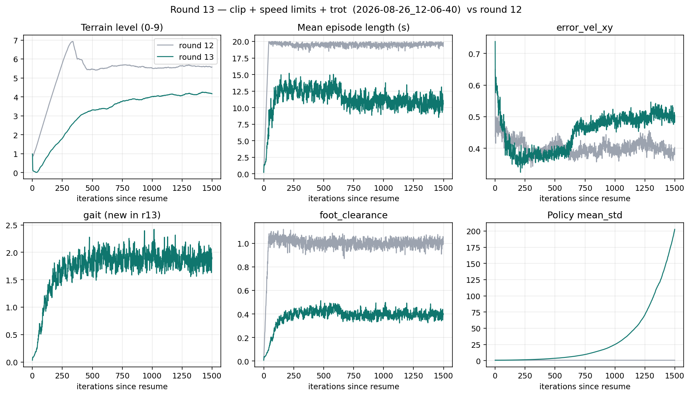
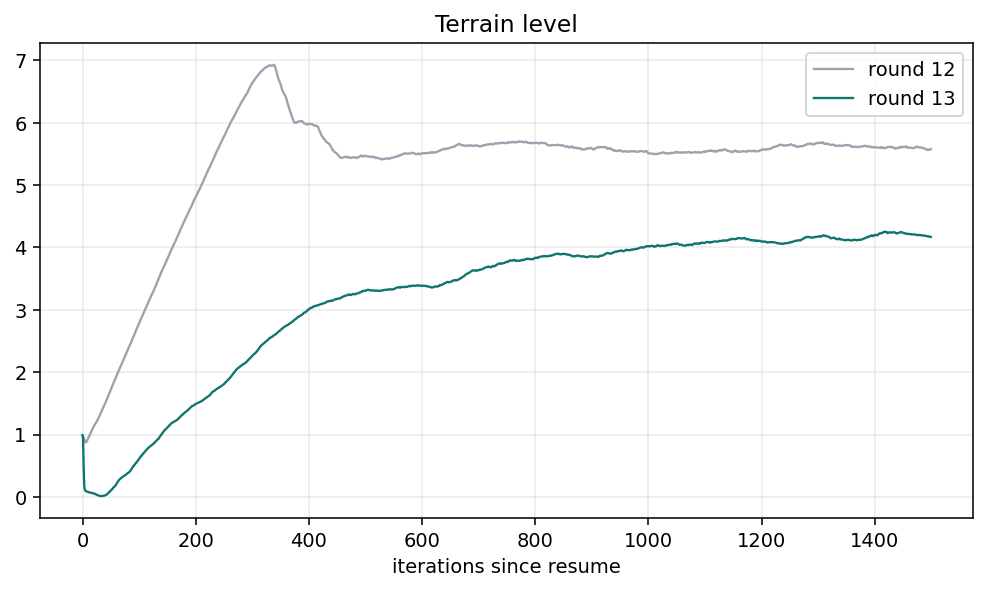

# 13차 — 걸음이 물리적으로 말이 되게

12차는 앞 스탠스 19% → 119%, 무릎 편차 0.7 → 0.3 rad. 자세는 로봇다워졌다.
GUI에서 남은 것:

| 본 것 | 실측 (model_7148, 직진 1 m/s) |
|---|---|
| 왼앞다리가 순간이동 | 왼앞 무릎 p99 **50 rad/s**, 한 스텝 Δq **1.14 rad**. 다른 무릎은 5 rad/s |
| 나머지 다리가 두둥실 | 한 발만 접지 **19%**. 대각선 트로트 접지율 51%. 몸 높이 std는 4 mm — 떠서 아님 |
| 왼앞 스윙 0.08 s, 왼뒤 0.25 s | 실기 Spot 스윙 0.20–0.35 s. 비대칭 |

과속 52%·요 흔들림은 12차에서 미룬 추종 문제라 **이번에도 안 건드린다.**
자세와 속도를 같이 바꾸면 무엇이 걸음을 죽였는지 구분할 수 없다.

## 원인 — 한도가 없다

세 구멍이 같은 스윙을 싸게 만든다.

1. **`clip_actions = None`.** `목표각 = 기본각 + 0.4 × a` 인데 a가 −6.56까지 나간다. 타깃 오프셋 2.6 rad. 왼앞 무릎은 78%의 스텝에서 `|a| > 1`.
2. **관절 속도 한도를 PhysX에 바로 넣으면 안 됨.** URDF는 hip 17.647 / knee 12 rad/s. 첫 resume (`2026-08-26_12-01-34`)에 `velocity_limit_sim`을 그 값으로 넣었더니 12차 정책의 50 rad/s 스윙을 PhysX가 급제동했다. 40 iter 만에 에피소드 1초, `bad_orientation` 0.52, 지형 레벨 0. 끊고 속도 한도는 **빼 둠.** 이번 라운드의 속도 상한은 클립이다: `|a|≤1` → 타깃 기본 ±0.4 rad. PD가 20 ms에 따라가면 최대 약 20 rad/s.
3. **걸음 박자 항이 없음.** Isaac Lab 공식 Spot은 `GaitReward`로 FL+RR / FR+RL을 맞춘다. 우리는 발이 뜨기만 하면 `foot_clearance`를 주고, 짧은 스윙은 `feet_air_time`이 0으로 잘려 벌도 없다.

Kp=80 × 오프셋 2.6 rad = 208 N·m. 무릎 토크 한도 115로 잘려도, 0.35 kg 하퇴는 20 ms 안에 1 rad 넘게 간다.

## 이번 묶음 (걸음 하나, 손잡이 셋)

| 손잡이 | 값 | 무엇을 막나 |
|---|---|---|
| `clip_actions` | **1.0** | 타깃이 기본 ±0.4 rad 안에 갇힘. 한 스텝 최대 Δq 0.8 rad |
| `effort_limit_sim` | URDF: hip 45 N·m, knee 115 | PhysX 토크 한도. 속도 한도는 넣지 않음 (위 실패) |
| `gait` (신규, Lab Spot `GaitReward`) | **+5.0** | 대각선 트로트. Lab는 10. 추종 로그 ~3을 안 덮으려고 절반 |

추종 std 1.0, `track_lin_vel_xy_dot` 1.5, PD 80/3, 지형 커리큘럼, 자세 항은 12차와 같음.

`gait`는 명령 또는 몸 속도가 있을 때만 켠다 (`velocity_threshold=0.5`). 서서 네 발을 맞추라고 강요하지 않는다.

## 안 바꾸는 것

- 추종 std 1.0, `cmd · v` → 과속은 14차.
- 명령 0에서 발 들기 전용 항. 12차 `leg_joint_deviation`이 99.7% → 21.5%로 줄였다. 나머진 다음.
- 자기충돌. 스폰 형상 겹침 위험이 있어 별건.

resume: `2026-08-25_16-31-31/model_7148.pt` · 4096 환경 · 1500 iter.
클립 이후 옛 정책의 `|a|>1` 출력은 잘린 채로 환경에 들어간다. 네트워크가 바로 적응한다.

첫 시도 `2026-08-26_12-01-34` 는 `velocity_limit_sim` 때문에 40 iter 만에 끊음.
본 런: `logs/rsl_rl/rough_spot_with_arm/2026-08-26_12-06-40/` · iter 7148 → 8648.

## 게이트

12차 끝(iter 7148)과 비교. 지형 레벨은 resume 하면 0에서 다시 오른다.

| 보이면 | 뜻 |
|---|---|
| 에피소드가 20초를 유지하고 지형 레벨이 5 근처로 다시 오름 | 한도를 넣어도 걸음을 안 잃음. 목표 |
| `Episode_Reward/gait` 가 0에서 올라감 | 대각선 접지가 맞고 있음 |
| 길이 5초 밑, `bad_orientation` 급증 | 클립이 보폭을 죽였거나 gait 5.0 이 과함. `gait` 부터 2.5로. `velocity_limit_sim` 은 이미 실패해서 없음 |
| 길이는 20초, `gait` 가 끝까지 ~0 | 항이 발 이름을 못 찾았거나 게이트가 닫힘. `check` 후 이름부터 |
| 지형 레벨이 3 밑에서 멈춤 | 클립이 보폭을 죽였음. scale 0.4 는 유지하고 gait만 낮춤 |
| `error_vel_xy` 가 0.4 근처 유지 | 추종을 안 건드렸으니 과속은 그대로여야 정상 |

학습이 끝나면 `diagnose_gait_timing.py` 로 왼앞 무릎 p99와 한 발 지지 비율을 다시 잰다.

목표 숫자:

| | 12차 | 13차 목표 |
|---|---:|---|
| 왼앞 무릎 \|v\| p99 | 50 rad/s | **≤ 20** (클립이 만드는 상한. URDF 12는 다음) |
| 한 발 접지 프레임 | 19% | **< 5%** |
| 대각선 트로트 접지율 | 51% | **> 70%** |
| 왼앞 스윙 | 0.08 s | **0.15–0.30 s** |

---

## 결과

런: `logs/rsl_rl/rough_spot_with_arm/2026-08-26_12-06-40/` · iter 7148 → 8647 · `model_8647.pt`

| | 12차 끝 | 13차 끝 (학습 로그) | 13차 PLAY 실측 |
|---|---:|---:|---:|
| 지형 레벨 | 5.58 | 4.17 | — |
| 에피소드 | 19.8 s | **10.6 s** | — |
| `time_out` | 0.955 | 0.411 | — |
| `base_contact` | 0.026 | 0.446 | — |
| `gait` | (없음) | **1.88** | — |
| `error_vel_xy` | 0.403 | 0.484 | — |
| `mean_std` | 0.70 | **203** | 추론은 평균만 씀 |
| 왼앞 무릎 \|v\| p99 | 50.4 | — | **5.9** |
| 한 발 접지 | 19% | — | **0.0%** |
| 대각선 트로트 접지율 | 51% | — | **78%** |
| 왼앞 스윙 | 0.082 s | — | 0.125 s |
| 2발 접지 | 50% | — | **73%** |

### 된 것 (추론 정책, clip 안)

`diagnose_gait_timing.py` · 평지 PLAY · 강제 직진 1 m/s · 64 env × 800 step.

순간이동과 두둥실의 숫자는 목표를 넘었다.

- 왼앞 무릎 p99 50 → **5.9 rad/s**. 한 스텝 1.14 rad 점프가 사라짐.
- 한 발만 땅에 있는 프레임 19% → **0%**.
- 대각선 트로트 접지율 51% → **78%**. 2발 접지 50% → 73%.
- 왼뒤 듀티 0.33 → 0.54. 네 발 스윙이 0.125–0.199 s로 비슷해짐. 목표 0.15–0.30에는 왼앞만 아직 짧다.

`gait` 항은 0.03 → 1.88로 실제로 먹었다. 클립이 타깃을 ±0.4 rad에 가둬서 무릎이 더 이상 한계를 넘지 않는다.

### 안 된 것 — `mean_std` 0.70 → 203

학습 로그는 나쁘다. 에피소드 20초 → 10.6초, 넘어짐 4% → 45%, 지형 레벨 5.6 → 4.2.
원인은 걸음이 아니라 **로그-공간 std가 클립 밖에서 폭주**한 것이다.

엔트로피 보상이 잘리기 전 가우시안의 폭을 키운다. `clip_actions=1.0`이면 환경은 항상 ±1만 보므로, std를 키워도 행동 분포는 안 바뀌고 엔트로피 점수만 오른다. PPO가 std를 무한히 키우는 게 최적이다. iter 7900 근처에서 9 → 19 → 42 → 95 → 203.

추론은 평균만 쓰므로 PLAY는 아직 걷는다. **이 체크포인트를 resume 하면 안 된다.** 다음 라운드는 12차 `model_7148`에서, std 상한을 넣거나 `entropy_coef`를 낮춘 뒤에 클립을 다시 켜야 한다.

과속·요는 이번에도 안 건드렸다. 14차 후보 그대로다.

