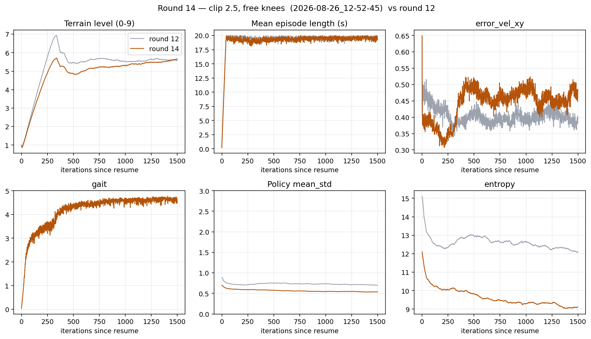

# 14차 — 클립을 열고 무릎을 푼다

13차는 실패다. PLAY에서 트로트 서명 51%→78%, 한 발 접지 19%→0% 가 나와도
학습 로그가 죽었고, GUI에서 무릎은 ㄱ자를 유지한 채 hip만 흔들렸다.

**이 체크포인트(`model_8647`)에서 이어가면 안 된다.** 12차 `model_7148`에서 다시.

## 13차 로그에서 이상한 것

| 항 | 12차 끝 | 13차 끝 | 뜻 |
|---|---:|---:|---|
| `Policy/mean_std` | 0.70 | **203** | 로그-std 폭주. 클립 밖 가우시안에 엔트로피 점수를 줌 |
| `Loss/entropy` | 12.1 | **75.9** | 위와 같음. 12차원 std≈e^(75.9/12)≈550 근처 |
| `Loss/learning_rate` | 1.1e−4 | **1.5e−3** | adaptive KL. 클립 때문에 실제 정책 변화가 작아 KL이 낮고 lr이 커짐 |
| `Loss/value` | 0.11 | 0.67 | value가 안 따라감 |
| 에피소드 | 19.8 s | **10.6 s** | 넘어짐. time_out 0.96→0.41 |
| `base_contact` | 0.026 | **0.446** | 몸통이 땅에 찍힘 |
| `track_lin_vel_xy_dot` | 1.77 | 0.80 | 속도 추종이 반토막 |
| `foot_clearance` | 1.02 | 0.40 | 발을 덜 듦 |
| `Train/mean_reward` | 13 | **32** | gait +1.88 이 넘어짐 −0.15 를 가림. 비교 금지 |
| `success_rate` | 0.033 | **0** | |
| 왼앞 무릎 \|v\| p99 (PLAY) | 50 | 5.9 | 순간이동은 사라졌고, 대신 **잠김** |

엔트로피 보상은 자르기 **전** 가우시안의 폭을 본다. `clip_actions=1.0`이면 환경은 ±1만 받으므로
std를 키워도 행동은 안 바뀌고 점수만 오른다. PPO의 최적이 std→∞.

## 무릎이 ㄱ자인 이유

기본 무릎 −1.5 rad ≈ 86°. 그게 ㄱ이다.

13차 `clip=1.0` × `scale=0.4` → 타깃이 기본 **±0.4 rad** 안에 갇힘.
무릎 가동 가능 구간 **[−1.9, −1.1]**. 펴는 쪽 URDF 한계는 −0.25. 스윙에 필요한 0.5–1.0 rad가 물리적으로 안 들어간다.

거기에 `leg_joint_deviation` −0.2가 무릎을 −1.5로 당긴다. 클립이 범위를 잠그고, 편차 항이 그 안에 붙잡는다.
hip_y만 흔들리니 ㄱ자를 유지한 채 걷는 것처럼 보인다.

## 이번 묶음 (13차 실패의 원인만)

12차 자세(스탠스, hip_x)는 유지. 과속 std / `cmd·v` 는 또 안 건드린다.

| 손잡이 | 13차 | 14차 | 왜 |
|---|---|---|---|
| resume | 7148→8647 | **12차 `model_7148`만** | 8647의 std 203을 이어받으면 안 됨 |
| `clip_actions` | 1.0 (±0.4 rad) | **2.5 (±1.0 rad)** | 12차 가동폭 0.5–1.0 이 들어감. \|a\|~6.5 텔레포트는 잘림 |
| `leg_joint_deviation` | 다리 12개 | **`.*_hip_y`만** | 무릎을 −1.5에 붙잡지 않음. hip_x는 기존 −1.0 |
| `entropy_coef` | 0.01 | **0.005** | 클립 밖 엔트로피 이득을 절반으로 |
| `gait` | 5.0 | 5.0 | 트로트는 유지. 폭주의 원인은 클립이지 gait가 아님 |

`velocity_limit_sim` 은 넣지 않음 (13차 첫 시도에서 급제동).

## 게이트

`mean_std`가 핵심이다. 12차 끝 0.70.

| 보이면 | 뜻 |
|---|---|
| `mean_std` 가 2를 넘고 계속 오름 | 13차 재현. 즉시 끊고 clip를 3.0으로 더 열거나 entropy 0 |
| 에피소드 18초+, 지형 레벨 5 근처 | 클립을 열어도 걸음을 유지. 목표 |
| 무릎 PLAY p99 가 6 rad/s 근처 | 아직 잠김. deviation에서 무릎을 뺀 게 안 먹음 |
| 무릎 PLAY p99 가 다시 40+ | 클립 2.5 가 너무 큼. 2.0으로 |
| `gait` 가 1 위로 유지 | 트로트는 유지 중 |

resume: `2026-08-25_16-31-31/model_7148.pt` · 4096 · 1500 iter.

## 결과

런: `logs/rsl_rl/rough_spot_with_arm/2026-08-26_12-52-45/` · iter 7148 → 8647.
체크포인트 파일 이름도 `model_8647.pt` 다. **13차 `2026-08-26_12-06-40/model_8647.pt` 와는 다른 파일.**



### 학습 로그 — 13차 폭주는 재현되지 않음

| 항 | 12차 끝 | 13차 끝 | 14차 끝 |
|---|---:|---:|---:|
| `mean_std` | 0.70 | **203** | **0.54** |
| `entropy` | 12.1 | 75.9 | **9.12** |
| `learning_rate` | 1.1e−4 | 1.5e−3 | 2.6e−4 |
| 에피소드 | 19.8 s | 10.6 s | **19.3 s** |
| `time_out` | 0.955 | 0.411 | **0.944** |
| `base_contact` | 0.026 | 0.446 | **0.035** |
| 지형 레벨 | 5.58 | 4.17 | **5.66** |
| `gait` | (없음) | 1.88 | **4.48** |
| `track_lin_vel_xy_dot` | 1.77 | 0.80 | 1.67 |
| `foot_clearance` | 1.02 | 0.40 | 0.85 |
| `error_vel_xy` | 0.403 | 0.484 | 0.485 |
| `success_rate` | 0.033 | 0 | 0.014 |

`mean_reward` 는 13 → 32 → 115. gait 항이 들어가서 라운드 간 비교 금지.

`mean_std` 는 0.70 → 0.54 로 줄었고, 에피소드·지형·넘어짐은 12차와 같다. 13차의 std 폭주·lr 폭주·몸통 찍힘은 없다.

### PLAY — 잠김은 풀렸고, ㄱ 웅크림은 남음

평지 PLAY, 강제 직진 1 m/s.

| | 12차 | 13차 PLAY | 14차 PLAY |
|---|---:|---:|---:|
| 왼앞 무릎 \|v\| p99 | 50.4 | 5.9 | **6.9** |
| 왼뒤 무릎 \|v\| p99 | — | — | **12.8** (URDF 12) |
| 한 발 접지 | 19% | 0% | **0%** |
| 트로트 서명 | 51% | 78% | **80%** |
| 왼앞 스윙 | 0.082 s | 0.125 s | 0.120 s |
| 2발 접지 | 50% | 73% | **80%** |
| 앞 스탠스 | 119% | — | **115%** |
| 몸통 높이 | — | — | 0.426 m (기본 서기 0.54) |
| 왼앞 무릎 mean | −1.764 | ~−1.5 잠김 | **−1.895** |
| 왼앞 무릎 p95−p5 | 스윙 유지 | ±0.4 안에 가둠 | **0.70 rad** |

무릎 스펙트럼 피크는 네 다리 모두 **2.54 Hz** (보폭). `|dq|/step` p99 는 왼앞 0.20 rad — 12차의 1.14 rad 점프는 없다.

잠김 게이트(p99 ≈ 6 이고 안 움직임)는 **빗나갔다.** 왼앞 p99 6.9 이지만 가동폭 0.70 rad 가 있고, 뒤 무릎은 10–13 rad/s 까지 간다. 13차처럼 ±0.4 rad 에 붙잡혀 있지는 않다.

다만 네 무릎의 p95 가 전부 기본값 −1.5 보다 **더 접힌** 쪽에 있다. 즉 펴는 쪽(URDF −0.25)은 안 쓰고, −1.6 ~ −2.5 에서만 움직인다. ㄱ자를 **고정**한 게 아니라, ㄱ자 **더 깊게** 굽힌 채 hip_y 로 보폭을 내는 쪽이다. 몸통 높이 0.426 m 도 그 웅크림이다.

클립 2.5 도 아직 포화한다. 강제 직진에서 `front_left_hip_y` 액션 p99 **4.3**, `rear_left_knee` p1 **−4.1**. 환경은 ±2.5 만 본다.

과속은 그대로다. 명령 vx=1.0 에 실제 **1.51**. 이번에도 안 건드렸다.

PLAY:

```
python scripts/play.py --task Isaac-Velocity-Rough-Spot-Arm-RoughTest-v0 \
  --num_envs 32 --real-time --viz kit \
  --checkpoint logs/rsl_rl/rough_spot_with_arm/2026-08-26_12-52-45/model_8647.pt
```
