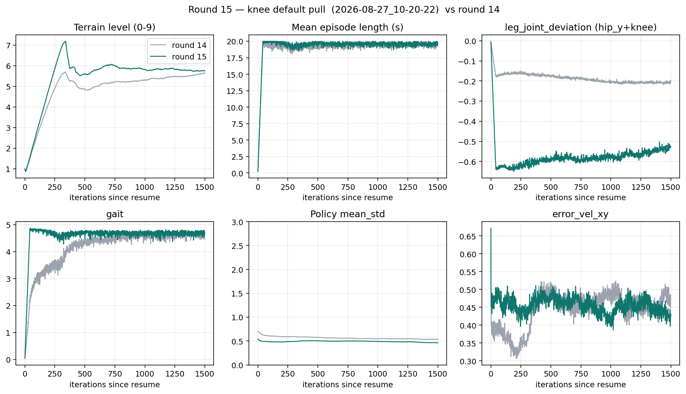

# 15차 — 무릎을 기본 자세로 약하게 당긴다

14차는 std 폭주를 고쳤지만 무릎 평균이 −1.9 ~ −2.2 에 머물렀다.
시연 Spot도 −1.5 근처에서 굽은 채 걷는다. 문제는 “곧게 펴기”가 아니라
**기본보다 더 웅크린 오프셋**이다.

무릎만 “펴라”는 항·몸통 높이 항은 쓰지 않는다. Isaac Lab Spot은
`joint_position_penalty` (−0.7, default로 당김) 을 쓰고 `base_height` 는 안 쓴다.
같은 종류로, 14차에서 뺐던 무릎을 `leg_joint_deviation` 에 다시 넣는다.

## 노브

| | 14차 | 15차 |
|---|---|---|
| resume | 12차 7148 | **14차 `2026-08-26_12-52-45/model_8647.pt`** |
| `leg_joint_deviation` | `.*_hip_y` only | **`.*_hip_y` + `.*_knee`**, weight −0.2 |
| clip / gait / `cmd·v` / 질량 | 2.5 / 5.0 / 1.5 / URDF | 그대로 |

`hip_x_deviation` −1.0 은 유지. 과속·질량·자기충돌은 안 건드림.

## 학습 중

TensorBoard · `python docs/training/round-15/watch_gates.py logs/rsl_rl/rough_spot_with_arm/2026-08-27_10-20-22`

이번에 손댄 건 `leg_joint_deviation` 뿐이라 **`Episode_Reward/leg_joint_deviation`이 −0.20→−0.53** 으로 더 음수로 가는지, 나머지 항·`mean_std`·에피소드 길이가 14차와 같이 유지되는지 본다. `Train/mean_reward` 는 14→15차 비교 의미 없음 (항 구성 동일하지만 스케일이 이미 바뀐 뒤).

| TensorBoard | 보이면 | 뜻 |
|---|---|---|
| `leg_joint_deviation` | −0.5 근처 | 무릎+hip_y 당김이 실제로 켜짐 |
| `mean_std` | **>2** 상승 | 13차 재현. 즉시 끊음 |
| `mean_episode_length` | **18 s+** | 걸음 유지 |
| `terrain_levels` | **~5** | 험지 커리큘럼 유지 |
| `base_contact` | 급증 | 넘어짐 늘음 |

그래프: [01-reward-terms.png](figures/01-reward-terms.png) · [03-ppo-health.png](figures/03-ppo-health.png) · [04-tracking-gait.png](figures/04-tracking-gait.png)

PLAY에서 무릎 mean·가동폭은 아래 결과 표. 학습 끝 검증:

```bash
python scripts/evaluate_rollout.py \
  --checkpoint logs/rsl_rl/rough_spot_with_arm/2026-08-27_10-20-22/model_10146.pt \
  --json docs/training/round-15/data/round15_rollout.json
```

resume: 4096 · 1500 iter.

## 결과

런: `logs/rsl_rl/rough_spot_with_arm/2026-08-27_10-20-22/` · iter 8647 → 10146 · `model_10146.pt`



### 학습 로그 — 유지

| 항 | 14차 끝 | 15차 끝 |
|---|---:|---:|
| 지형 레벨 | 5.66 | **5.75** |
| 에피소드 | 19.3 s | **19.7 s** |
| `time_out` | 0.944 | **0.962** |
| `base_contact` | 0.035 | **0.019** |
| `gait` | 4.48 | **4.69** |
| `mean_std` | 0.54 | **0.46** |
| `leg_joint_deviation` | −0.20 (hip_y만) | **−0.53** (hip_y+knee) |

std 폭주 없음. 넘어짐은 더 줄었다.

### PLAY — 웅크림이 줄었다

평지, 강제 직진 1 m/s.

영상: [videos/round-15-play.webm](videos/round-15-play.webm)

| | 14차 | 15차 | 기본 |
|---|---:|---:|---:|
| 왼앞 무릎 mean | −1.895 | **−1.754** | −1.500 |
| 오른앞 무릎 mean | −2.138 | **−1.805** | −1.500 |
| 왼뒤 무릎 mean | −2.203 | **−2.012** | −1.500 |
| 오른뒤 무릎 mean | −2.063 | **−1.856** | −1.500 |
| 몸통 높이 | 0.426 m | **0.469 m** | 서기 0.54 |
| 대각선 트로트 접지율 | 80% | **79%** | — |
| 왼앞 무릎 가동폭 (p95−p5) | 0.70 | 0.42 | — |

`대각선 트로트 접지율`: 걷는 프레임 중 FL+RR / FR+RL 중 **정확히 한쪽 대각선만** 접지인 비율 (`diagnose_gait_timing.py`).
`가동폭 (p95−p5)`: 관절각 분포의 95백분위 − 5백분위. 작으면 거의 안 움직이는 잠김.

앞 무릎이 기본 −1.5 쪽으로 ~0.14–0.33 rad 돌아왔다. 뒤 무릎은 아직 더 접혀 있다.
가동폭은 남아서 잠기지는 않았다. 몸통도 4 cm 올라갔다.

높이 항·과속·질량은 그대로 안 건드렸다. `evaluate_rollout` 기준 **vx 1.44 m/s** (명령 1.0, ratio 1.44) — 과속은 16차 후보. 뒤 무릎 잔여 웅크림도 다음 후보.

PLAY GUI:

```
python scripts/play.py --task Isaac-Velocity-Rough-Spot-Arm-RoughTest-v0 \
  --checkpoint logs/rsl_rl/rough_spot_with_arm/2026-08-27_10-20-22/model_10146.pt \
  --real-time --viz kit
```

